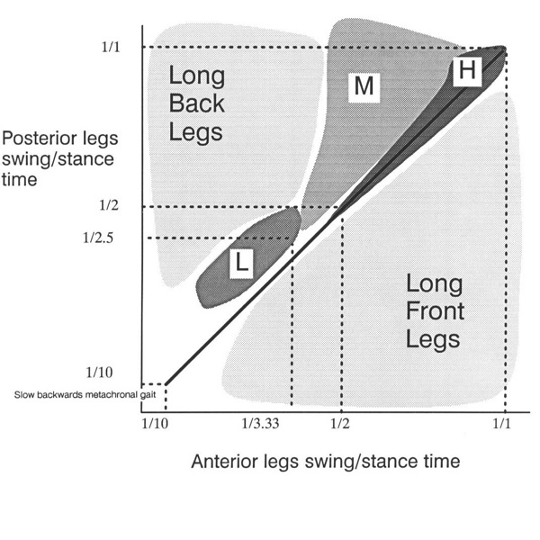

# HEXAPOD GAIT CONTROL BY A NEURAL NETWORK

Paper published in International Joint Conference on Neural Networks, San Diego, 1990. pp. I:189-194. This version includes supplemental materials from the slides used at the talk.

Nick Porcino

University of Victoria, Canada

## Abstract

The consideration of neurophysiological data from invertebrate nervous systems and various theories of motor control leads to a robust and biologically plausible architecture for a neural controller for hexapod locomotion. It is an open question as to whether gait generation is the result of peripheral sensory input, or whether it is a function of central control. The controller proposed here attempts to reconcile the two arguments by using simple reflexes as observed in the locust to generate the basic swing-stance cycle, and contralaterally and ipselaterally inhibitory central pattern generators to affect coordination of the stepping patterns. When this system is modeled using a network of biologically realistic neurons, it generates walking patterns that respond adaptively to the environment. The patterns generated correspond well to data found in the physiological literature.

## 1. AN INTRODUCTION TO INVERTEBRATE NERVOUS SYSTEMS

The relative simplicity of the invertebrate nervous system raises the possibility of delineating, understanding and simulating the entire nervous system. There are on the order of one hundred thousand neurons in such a system, of which about half are probably concerned with the reduction of sensory information. There are on the order of a thousand motor neurons and the number of interneurons controlling and modulating the motor neurons is likewise quite small (Hoyle, 1976)[^Hoyle-1976].

![Figure 1. The ladder architecture as illustrated by the neuronal network of the leech.] (hexapod90/leech.jpg "Nervous System of the Leech")

The fundamental organization of the invertebrate nervous system resembles a ladder of ganglia: the "rungs" are formed by segmental ganglia and the cerebral and caudal ganglia form the two ends. The ladder architecture can be found controlling swimming in the leech, crawling in Nereis, chewing in the lobster's stomach, and walking in insects.

Through the mechanism of inhibitory connections between ganglia, the ladder circuit forms a pattern generator. The leech's swimming motion is effected by contraction of the muscles on one side and relaxation on the other, possibly caused by symmetrical spikes firing both sides. The patterns provide a low energy operational modality - the neurons settle into a sort of cooperative pattern that allows all the neurons to fire maximally. As an example, two identical neurons connected such that each inhibits the other settle into a pattern where they fire alternately, with spikes maximally separated in time. This circuit is called the "half-center" model (Pearson, 1976[^Pearson-1976]). Figure 2 shows the results of a simulation which demonstrates the half-center model undergoing the process of entrainment.

Pattern generators often produce several characteristic patterns, each modulated by varying levels of excitatory or inhibitory activity on the individual neurons. In a walking controller, for example, several gaits can exist as emergent properties of the system, for example, walk, pace, canter, trot, or run. All the patterns are produced by the same circuit, but are a consequence of different levels of tonic excitation, differential activation of interneurons in the circuit, or hormonal modulation. The overall behaviour of the organism is a function of its perception of the environment, modulated by the senses, and controlled by the brain.

## 2. THE NEURAL CONTROL OF LOCOMOTION

> The similarity of the walking systems in the cat and the cockroach suggests that the number of ways of optimally constructing a walking system is quite limited. - Keir Pearson (1976)

This section addresses the question of whether gait patterns are produced primarily through central pattern control or through peripheral sensory signals. There is evidence for both arguments: the cockroach tends to operate in a "ballistic mode," moving in straight lines at top velocity using a simple gait. Sophisticated sensory driven pattern generation would be superfluous. On the other hand, an insect taking careful steps on a treacherous surface will have to rely quite heavily on the information coming back from its feet (personal communication, Beer, 1989).

Locomotor control is similar in all organisms - mediated by the brain but controlled locally by the ganglia. When the brain of a cat or cockroach is severed from the central nerve cord, it will walk if pushed or placed on a treadmill (Pearson, 1976). Clearly, the stepping motion is initiated by sensory feedback. The generated gaits are not as regular as those produced by an intact animal, indicating the importance of central control. The locomotion controller proposed here attempts to reconcile the two mechanisms. Sensory feedback is shown to be sufficient to drive the stepping reflex of a single leg, however a circuit with no central control will generate rather arbitrary gait patterns unlike the regular patterns produced with the mediating influence of central control.

### 2.1: THE ROLE OF SENSORY FEEDBACK

Theory suggests that loading sensors prevent a leg's controlling ganglia from generating swing signals during the stance phase, thus preventing the swing phase from being initiated when a leg is carrying a significant portion of an animal's weight (Pearson, 1976). When another leg is placed down, it begins to carry some weight, relieving the weight on an already placed leg, thereby allowing that leg to swing. Experiment reveals that load information plays the largest part in allowing an organism to adapt to different terrains (Kaneko, Ihnie, & Than, 1989 [^Kaneko-et-al-1988]).

Beer, Chiel, and Sterling [^Beer-Chiel-Sterling-1989] used backward and forward angle sensors to detect the extreme leg positions, and thus provided the first step towards a sensory driven locomotor controller. The controller is illustrated in Figure 3. The backwards angle sensor excites the central pattern generator, predisposing it to fire and therefore swing the leg forward. The forward angle sensor inhibits the pattern generator, preventing the central pattern generator from hyperflexing the leg. The forward angle sensor also excites the extensor motor neuron to begin the backwards cycle. In the model described by Beer et al, these sensors were binary, firing at the extreme positions, but providing no detailed positional information.

Natural sensory afferents have nonlinear responses, as do the sensors used by the simulations in this paper. The more extreme the angle of the leg, the greater the sensory neuron firing frequency. Thus, for very extreme angular displacements, the signals can't be ignored, and are therefore analogous to pain. This observation points the way to learning in the circuit, perhaps via operant conditioning (Klopf, 1982 [^Klopf-1982]). Learning in these reflex circuits is not explored in this paper.

The insect's leg has a variety of mechanoreceptors, some of which correspond to forward and backward angle sensors: the spurs at the back of the foot signal backward extension, strain sensors in the insect's exoskeleton act as forward angle sensors. In addition, the pads on the bottom of the insect's foot, the pulvilli, are load sensors (see Figure 4 to the left).

Most of the process of walking is carried out by four groups of muscles within the body which use the whole leg as a lever to propel the body forward. The muscles controlling the leg are the flexors, extensors, levators, depressors, and refractors. Flexors bring the leg forward, extensors push it back. Levators lift the leg, and depressors push it down. Retractors retract the claw at the end of the tarsus.

A detailed, yet conceptually simple sequence of sensory events drives the stepping reflex. Figure 5 above shows some of the main connections from sensory afferents to motoneurons, summarizing the data of Laurent and Hustert, 1988 [^Laurent-Hustert-1988]. In the discussion that follows, stance refers to the phase of the stepping cycle when the foot is in contact with the ground, and swing refers to the phase when the leg is swinging forward in preparation for another stance phase.

1. At the beginning of the stance phase the pulvilli contact the ground, exciting the depressor and retractor motor neurons and inhibiting the levator motor neurons.
2. The excited depressor pushes the foot more strongly against the ground. Simultaneously, the extensor thrusts the body forward. The depressor is thus coupled with the extensor.
3. The excited retractor pulls the unguis in until the claw touches the ground. The claws further excite the retractor insuring a firm and reliable contact with the ground.
4. By the end of the stance phase the claw is fully retracted, and the leg is extended towards the rear of the animal. The leg is almost ready to begin the swing phase.
5. The distal anterior spurs touch the ground exciting the depressor motoneurons and inhibiting the levator and retractor motorneurons. This provides final thrust and preparation before the swing phase.
6. Other legs begin to carry the animal's weight, the claw relaxes, pressure on the pulvilli is decreased.
7. Inhibition to the levator is almost gone allowing the tarsus and then the leg to be levated. The leg is swung forward by the flexor in preparation for another step.

The dotted connections in Figure 5 illustrate a reflex reaction - touching the dorsal surface of the tarsus causes a strong levation reaction. This is a stumble reflex: if the top of the tarsus hits some obstacle, the leg is lifted to avoid the obstacle. Figure 6 shows the complete circuit as implemented in the simulations.

The proposed controller uses the circuitry of Figure 6 duplicated 6 times (once for every leg). The complete circuit was simulated with the Hodgkin-Huxley type neurons described the Appendix and the connection strengths were manually fine-tuned. If the six central pattern generators are not interconnected, the circuit walks, driven by sensory feedback. The gait patterns generated by this circuit are highly irregular however, due to the lack of any sort of inter-leg coordination beyond that provided by load information. The simulated stepping reflex is quite robust and removing connections or randomly perturbing synaptic weights causes the gradual degradation of performance we have come to expect from neural nets (Chiel and Beer, 1989 [^Chiel-Beer-1989]).

Although the central pattern generator can drive the circuit, it can be removed from the circuit without significant effect to the stepping reflex, as the main purpose of the central pattern generator neuron is in intra-leg coordination, as will be detailed in the next section. A leg will keep stepping even if all connections are corrupted to some small degree, pointing to the inherent robustness of this circuit design.

### 2.2: THE ROLE OF CENTRAL PATTERN GENERATION

Observation tells us that contralateral and adjacent pairs of legs never swing at the same time (Pearson, 1976). A logical way to design a pattern generator, therefore, is to connect pattern generators (one for each leg) in an inhibitory ladder to produce coordination of all the legs, as in Figure 7. There is no central motor store, no programmed walking pattern. Coordination of the legs is an emergent behaviour of a distributed system. Section 3 details a number of modes of oscillation of this circuit. (This hypothetical architecture doesn't tell the whole story. Insects placed on water, for example, can propel themselves with synchronous contralateral kicks. Some arthropods can walk backwards or even sideways. These are radically different behaviours, elicited by different sensory input, and are not behaviours supported by this architecture. It is possible that each different behaviour is controlled by a collection of disjoint pattern generating circuits, selected by the cerebral ganglion (Hoyle, 1976)).

Making the rear legs of the insect longer gives them a lower stepping frequency. The inhibitory connections entrain the whole system to the frequency of the rear legs, producing a metachronal wave, where a ripple effect can be seen. In almost all species, the metachronal wave starts posteriorly and moves anteriorly. Figure 8 shows a time slice of activity in a simulated network of pacemakers connected in an inhibitory ladder. The rate of charging of the lowest pair of pacemakers has been slowed by lowering the tonic current input. By the end of the diagram, all the pacemakers have been entrained to the slower frequency.

The central pattern generators impose their oscillatory pattern upon the reflex circuit of Figure 6, thus generating coordinated walking patterns. The level of the tonic excitation to the extensor motoneuron controls the speed of the stance phase by controlling the power and speed of the thrust applied to the leg. The time taken for the stance controls the speed at which the animal travels and consequently the gait. The swing phase always takes approximately the same amount of time (Pearson, 1976). The cockroach can run at a continuous range of speeds, the various stepping patterns smoothly blend from one to the next. The natural modes of oscillation of the ladder architecture are the gait patterns generated by the model. It is easy to understand the patterns of oscillation, as can be seen in the following series of diagrams. For each gait the pattern of inhibition for each phase of the gait is shown, as is the standard gait diagram over a number of time steps. These gaits are merely representative, as a continuous range of gaits exists, each blending smoothly into the next.

It is the duration of the stance phase relative to the duration of the swing phase that determines the gait. Changing the length of the swing phase makes the gait slower, but the gait patterns remain unchanged when swing versus stance ratios are maintained.

Figure 9 summarizes the relationship between the duration of swing and stance phases. The length of the swing phase is unimportant, rather, it is the ratio of swing phase to stance phase which generates the different gaits. Swing time has therefore been normalized to 1.0 to generate the data in Figure 16. Note that the indicated data points are representative, and that the gaits smoothly blend into one another as the timing of the stance phases is changed. "Strange gaits" are gaits where the posterior legs step very much slower than the anterior legs, or gaits where the stance phase is significantly faster than the swing. Such gaits are not generally observed in nature.

It is clear from the graph that the swing/stance ratio is the factor which has the greatest effect on the resulting gait, although entrainment of the anterior legs duct to the lower speed of the posterior legs is sometimes a factor, as evidenced by the low speed gait.

This fastest gait (sometimes called high gear) alternates between two stable configurations. Note that between every step cycle, all feet are briefly on the ground. On page 325 of Gray, 1968[^Gray-1968], an example tripod gait is illustrated. The swing versus stance ratio reported by Gray is 1/1, in Accordance with the data reported in Figure 9. (I wish to note that data from Gray came to my attention after this study had been completed, and is included because of the remarkable coherence between natural data and computational results, supporting the predictive qualities of the model presented here.)

The middle speed gait (sometimes called middle gear) is a period three gait. The two gaits shown in Figures 11a and 11b differ by the relative phasing of the left and right legs. Naturally occurring gaits occur at some phasing combination between the extremes of these two gaits. The third combinatorial arrangement which would have the two sides in phase with each other is impossible because of the mutual inhibition of contralateral pairs of legs. The gait illustrated on p. 322 of Gray shows a medium speed gait which is half way between the two gaits illustrated in Figure 11. Gray's reported swing/stance ratio is 1/2, again exactly corresponding to the computational model. Only two legs swing at any time, due to the slower stance phase.

The low speed gait (sometimes called low gear) is a period four gait. The three extreme phasing configurations are shown in Figure 12. Once again, naturally occurring gaits occur somewhere between these extremes. Note that the gait in Figure 12a becomes the gait in Figure 11b if the stance phase is speed up slightly. As with the medium speed gait, the variations are produced by different phasing of the right and left stepping cycle. Again, a fourth gait is impossible to generate because of contralateral inhibition. As can be seen in Figure 9, the low speed gait is the only gait requiring the effects of entrainment of the rear legs. At lower speeds, the gait becomes driven by sensory information, and as in the case where the central pattern generators are not connected to each other, the gaits become can become arbitrary and chaotic, although stable. Other possible low speed gaits are a metachronal wave that progresses from front to rear, and long period gaits which are not detailed here. It should be possible to observe all gaits predicted by this model in nature.

### 3: CONCLUSIONS

A robust stepping reflex has been demonstrated, and it has been shown that some form of inter-leg coordination is necessary to generate regular gaits of the sort observed in nature. The generated gait patterns agree well with physiological data.

Future research will involve incorporating various behaviours into the controller. One way to do this is to have several independent controllers, activated by the cerebral ganglion. Enough circuits would then be able to generate the range of observable behaviours of an insect.

However, it is possible that rather than actually existing in an invertebrate's nervous system, these circuits simply describe the computation being done by a more general circuit of sensory inputs, control inputs, interneurons, and integrating ganglia. The individual circuits might not actually exist except as transient configurations of the entire nervous system, selected amongst by the cerebral ganglion, sensory stimulus, or hormonal modulation. A possibility then is to start with a more biologically plausible arrangement, such as that illustrated in Figure 14, and train this more plausible architecture to exhibit the desired behaviours using one of the standard dynamical neural net training algorithms. This approach has already met with considerable success elsewhere (Lockey et al, 1989 [^Lockey-et-al-1989]).

### REFERENCES

[^Beer-Chiel-Sterling-1989]: Beer, Randall D., Hillel J. Chiel, L.S.Sterling. __Heterogeneous Neural Networks for Adaptive Behaviour In Dynamic Environments__, in Advances in Neural Information Processing Systems, Volume 1. Morgan Kaufman Publishers, 1989

[^Chiel-Beer-1989]: Chiel, Hiliel J., & Randall D. Beer. __A Lesion Study of a Heterogeneous Artificial Neural Network for Hexapod Locomotion__, in Proceedings of International Joint Conference on Neural Networks 1989. pp. 1-407 - 1-414

[^Gray-1968]: Gray, James, __Animal Locomotion__. Weidenfeld and Nicolson, London, 1968, pp. 319-332

[^Hoyle-1976]: Hoyle, Graham. __Arthropod Walking__, in Neural Control of Locomotion, R.M.Herman, S.Griliner, PS.G. Stein, & D.G. Stuart (Eds). Plenum Press, New York, 1976, pp. 137-179

[^Kaneko-et-al-1988]: Kaneko, Makoto, Kazuo Tanie, and Mohamad Nor Bin Mohamad Than. __A Control Algorithm for Hexapod Walking Machine Over Soft Ground__. IEEE Journal of Robotics and Automation, Vol. 4, No. 3, June 1988, pp. 294-302.

[^Klopf-1982]: Klopf, A. Harry. The Hedonistic Neuron: A Theory of Memory, Learning, and Intelligence. Hemisphere
Press, Washington DC, 1982.

[^Laurent-Hustert-1988]: Laurent, Gilles & Reinhold Hustert. __Motor Nouronal Receptive Fields Delimit Patterns of Motor Activity During Locomotion of the Locust__. Journal of Neuroscience, vol. 8, no. 1 1, Nov. 1988. pp. 4349-4366

[^Lockey-et-al-1989]: Lockey, S.R., G. Wittenburg, W B. Kdstan Jr., N. Oian, and Terrence Sejnowski. __Neural Network Analysis of Distributed Representations of Sensory Information In the Leech__. Presentation at Neural Information Processing Systems Conference, Denver Colorado, Nov. 1989.

[^MacGregor-1987]: MacGregor, Ronald. __Neural and Brain Modeling__. Academic Press Inc., San Diego, 1987.

[^Pearson-1976]: Pearson, Keir. __The Control of Walking__. Scientific American, vol 276. Dec. 1976.

### APPENDIX: SIMULATING THE NERVOUS SYSTEM

The system of equations used to simulate the neural circuits detailed in this paper, and its description is based on the simple model described in MacGregor (1987, pp. 220-227)[^MacGregor-1987]. The equations model the standard equivalent electrical circuit of a biological neuron.

Each battery-potentiometer pair represents the transmembrane conductance of particular ion channels, and the capacitor represents long, electrically polarized lipoproteins in the membrane. 

The motion of the charge at the end of these lipoproteins corresponds to electrical current, and when an applied electric field displaces such a molecule, the transfer of energy which moves the protein corresponds to a classic capacitative effect in electromagnetic theory (MacGregor, 1987, pp. 246-250). The transmembrane conductances are typically modulated by synaptic activity, and the conductances determine the potential within the neuron.

The complete circuit as implemented in the simulation. Note that all large neurons have a self-excitatory connection not documented in the text of the paper. This connection was suggested by the biological literature, but the need for it could have been satisfied in other ways, such as tonic excitation, or more carefully tuned connection weights. In general, connection weights were not found to be important, as the exponential response against extreme inputs from the sensors was sufficient to tune the simulation. The simulation was also found to be largely robust against broken connections or bad weights.

The physical model of a leg used in the simulation. The coxa was simulated as two revolute joints. Muscles were simulated as linear actuators in agonist-antagonist pairs. Note the muscles wrapped over the knee and under the ankle - in the simulation these two were modeled as torque actuators. All muscles functioned as springs when no signal was applied. If no signals were applied, the leg would return the rest pose illustrated here.

A whimsical illustration of the simulated insect. The simulation was actually rendered from a 2D top down perspective with simple graphics.

The author wishes to thank Michael Ellis for helping with the programming of the simulation, and Dr. James Collins and Dr. Dale Shpak for helpful advice.
