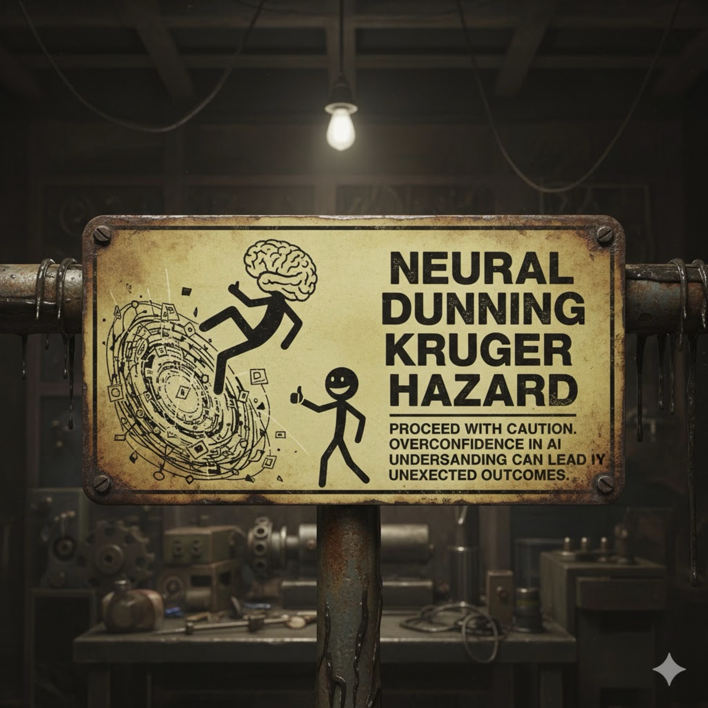
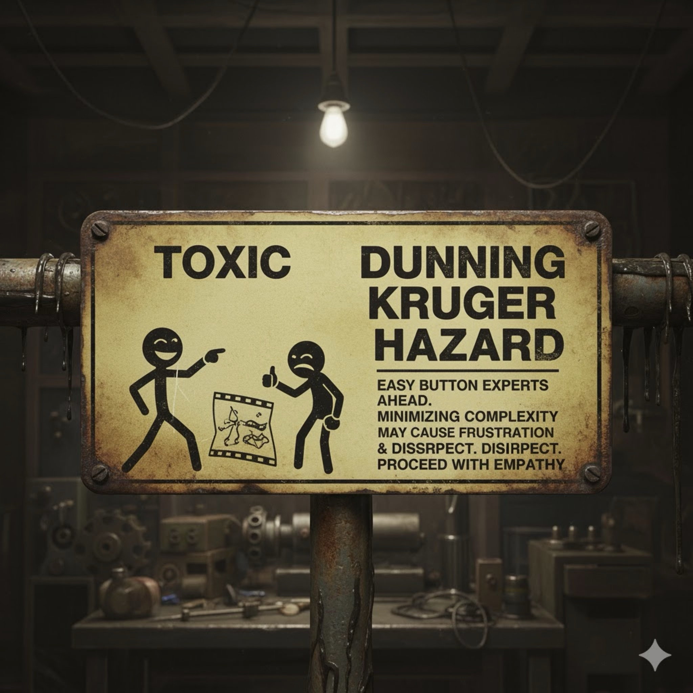
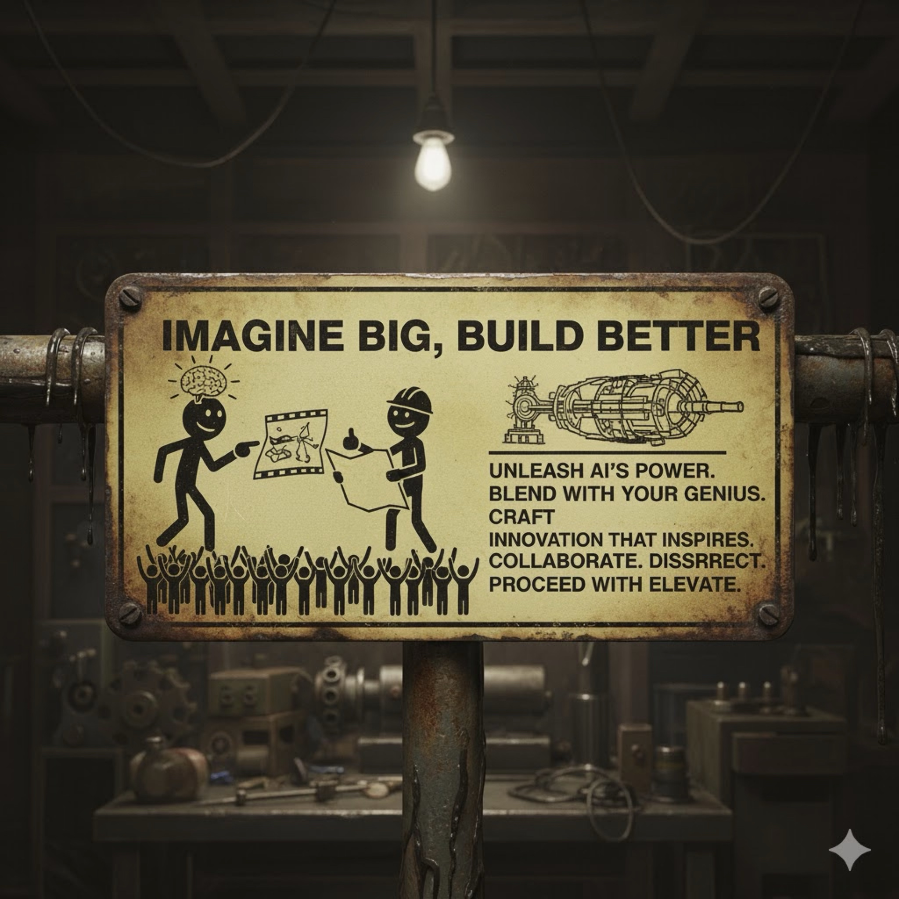

# Proceed With Elevate

(c) 2025 Nick Porcino

#### prompt

Let's generate a warning sign image, the classic dirty machine shop sort, I'd like to show on the left some stick figure experiencing a hazard, and the lettering should say: **Neural Dunning Kruger Hazard**

## NEURAL DUNNING KRUGER HAZARD
**PROCEED WITH CAUTION. OVERCONFIDENCE IN AI UNDERSANDING CAN LEAD IY UNEXECTED OUTCOMES.**

#### prompt

Let's make a second one. This one is to illustrate a downside of neural dunning kruger - **Toxic Dunning Kruger Hazard**. That's the case where someone says something like "I made a Pixar movie in 8 minutes" and is meant to belittle the hard work of others.

## TOXIC DUNNING KRUGER HAZARD
**EASY BUTTON EXPERTS AHEAD.**
**MINIMIZING COMPLEXITY MAY CAUSE FRUSTRATION & DISSRPECT. DISIRPECT.**
**PROCEED WITH EMPATHY**

#### prompt

Let's make a positive workplace poster for the garage like the old Think Twice Cut Once poster. In this case, we celebrate the great ideas that come from AI usage, but we apply our imagination and expertise for an outcome that uplifts others; **Imagine Big, Build Better**.

## IMAGINE BIG, BUILD BETTER
**UNLEASH AI'S POWER. BLEND YOUR GENIUS.**
**CRAFT INNOVATION THAT INSPIRES. COLLABORATE. DISSRRECT.**
**PROCEED WITH ELEVATE.**

Generated with Gemini.

