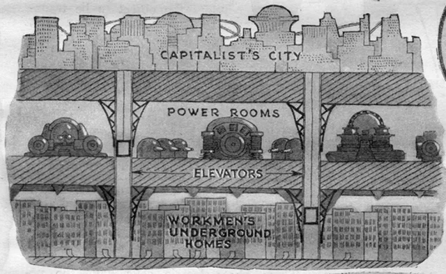
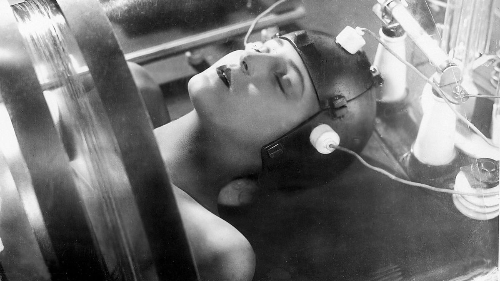
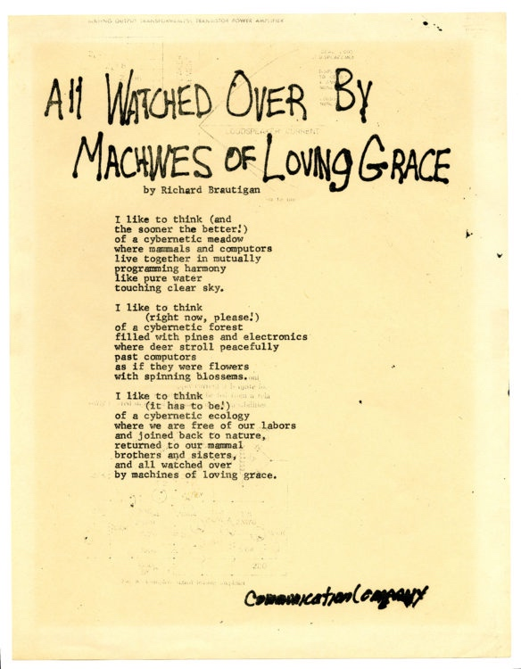

## Author's Preface

This paper is the result of a long journey into modern systems beginning in the 1980s at the start of my professional career. In those days I specialized in biomimetic neural architectures and computational neuroethology. I started not long before the first "AI Winter"; we were still chasing Pythagorean ideals - if we found the right numbers in their proper relation, the world would speak.

As funding and institutional interest for AI and neural networks dried up, I moved to the entertainment industry, where AI would find fertile ground in game logic and character control. Over the following decades, I watched an epistemic shift in the industry from focus groups - a human-centric conversational method of understanding preferences - to big data optimization. We stopped asking people what they liked, and began measuring the signals they could not help but emit. The individual was being dismantled into a stream of marketable "dividual" data-points long before the theory or the terminology caught up.

Later, I worked at Oculus Research (now Meta Reality Labs) on a sophisticated motion capture stage with a tongue in cheek name: The Sociopticon; so called because it could sense and measure every microscopic movement and sound of the subject within the ball of cameras and sensors. The name was a play on words, Bentham's Panopticon was a stucture that allowed visibility on many subjects from the inside out. The Sociopticon was an inversion, perfect visibility of a single subject from the outside in.

The name stayed with me, it seemed a confession of sorts. If that room was a Sociopticon, what was the world outside? Are we all now inside a global, distributed version of the stage, and to what end? 

Some time after stepping away from that physical stage, I began to look back on what I've learned since then, at what might be a blueprint of a captivity of our own making. I wound up tracing the origins of cybernetics - the formal theory of control, from its seeds in the ancient Greek recursive mind, through the "Great Chain" of the Middle Ages, the wartime anxieties of the 1940s, and the Narcissus Narcosis of the Electronic Age. What follows is an attempt to understand the "Permanent Present", a system of governance 2,500 years in the making.

## Abstract

Cybernetics did not emerge ex nihilo in 1948; it represents the technical crystallization of an ancient tension between systems of control and human autonomy. From the recursive *Nous* of Anaxagoras and the "managed cave" of Plato, to the rigid hierarchy of the Great Chain and the industrial acceleration of Metropolis, proto-cybernetic thinking has repeatedly surfaced as a response to systems falling to disorder. By tracing this lineage through the "asymmetrical feedback" of religious orthodoxy and the "lateral sensors" of Enlightenment satire, we find that Norbert Wiener did more than invent a new science, he formalized a historical impasse and gave us the mathematical and algorithmic tools to understand it. Today, as we navigate the "Sociopticon" of 2025, reading Wiener becomes an act of architectural diagnosis, a way to see the ancient cave walls hidden within our modern digital streams.

## I. Cybernetics Before Cybernetics

> *We have decided to call the entire field of control and communication theory, whether in the machine or in the animal, by the name Cybernetics, which we form from the Greek χυβερνήτης or steersman. In choosing this term, we wish to recognize that the first significant paper on feedback mechanisms is an article on governors, which was published by Clerk Maxwell in 1868, and that governor is derived from a Latin corruption of χυβερνήτης. We also wish to refer to the fact that the steering engines of a ship are indeed one of the earliest and best-­ developed forms of feedback mechanisms.*
> - Norbert Wiener, Cybernetics: or Control and Communication in the Animal and Machine (1948)

Wiener's definition of cybernetics announces a theory of control and communication applicable to machine and animal, anchoring its genealogy in mechanical apparatus - the steering engines of ships and the governors of steam engines. The animal, in this definition, feels rhetorical and it is often overlooked that Cybernetics is articulated from the outset as a fundamental property of life and applicable to animals, societies, as well as machines.

To read Wiener in 2025 is to realize he was reaching for a deeper, older idea: the biological concept of homeostais. Before the vacuum tube, there was Claude Bernard's milieu intérieur - the internal environment that remains stable despite a changing world, and Walter Cannon's formalization of the "wisdom of the body".

Wiener’s project was an attempt to find the biological soul within the machine, to bridge the gap between the living organism’s "wisdom" and the governor’s "logic." However, by grounding his proof in the mechanical, Wiener inadvertently prepared the way for the very thing he feared, the reduction of the biological to the algorithmic. If the animal can be explained by a set of feedback loops, then it can be optimized, it's operation modulated, and eventually replaced by the more evidential renderings of mechanisms in brass, steel, and engines.

Long before Maxwell, control existed as metaphysics, theology, ritual, and governance. Religious orthodoxy functioned as a closed-loop system designed to suppress deviation. Political theory organized populations through corrective feedback. Desired behavior is  rewarded, undesirable punished. Behavior is surveilled on behalf of systemic order, spectacle is mounted so that individuals watch each other. Philosophical cosmologies, from Pythagorean harmony to Platonic order, posited self-regulating universes whose stability depended on ideal Forms; their proportion, their hierarchy, and utlimately the return of everything to Form.

χυβερνήτης, the steersman, is an interpreter of signals, watching the wind, the current, and the stars. Kybernetes monitors the disposition of the vessel, and applies a steadying hand to the rudder and the setting of sails. Steering is much more than technology and mechanism, it is a relation, and beyond that a continuous modulation of response to deviation. Altogether, the steersman operates in service of a telos - a goal. Steering is an epistemic activity resting on what can be known, before it is a mechanical one affecting change. Wiener himself is quite clear on this point. The fact that the term cybernetics has been popularly reduced to its application to mechanical and computerized control makes it important to remind ourselves that cybernetics is fundamentally about systems, not devices.

Biological feedback, embodied in homeostasis, adaptation, and learning, was conceptually present in antiquity but suffered a break from formal philosophy in the post-Roman period. The dominance of teleology and theology, which framed regulation as purpose-driven or divinely mandated, stood in tension with the notion of dynamically emergent structure. To acknowledge feedback in animals and Nature was to threaten fixed hierarchies, and the relations between body and soul, ruler and ruled, Creator and creation.

Cybernetics has existed in one form or another for millenia, as an epistemic system meant to produce order out of chaos. As a pattern, as a proto-cybernetics, it appears historically as a recurring pattern of governance; one that repeatedly encounters resistance from the governed. As we shall see, whenever systems appear to self-regulate and thereby evade command, orthodoxy intervenes: whenever control becomes distributed rather than centralized, the deviation is reabsorbed into doctrine, incorporated and sublimated as myth, or regulated via mechanism.

---

## II. Ancient Systems: Number, Order, and the Closed Cosmos

Between the proto-cybernetic intuitions of antiquity and the formation of modern institutions lies a period of extraordinary intellectual exploration. This era witnessed a nearly continuous explosion of invention, abstraction, cosmic theories, and institutional experimentation. Order was not yet a mechanical mandate but a negotiated reality between overlapping systems of meaning. Empire, philosophy, ritual, and craft coexisted within localized coherence, united by the shared understanding that frontiers of belief and administration were essential to prevent the collapse of order into chaos.

Pythagoras offered the earliest attempt to formalize order as a universal principle; he claimed number as ontological, the very substrate of reality. In the Pythagorean view, harmony, ratio, and proportion governed music, geometry, and the cosmos itself. Relations mattered more than substance; balance emerged from constraint. With Euclid, this relational thinking became foundational: number no longer stood alone but existed within the architecture of structure.

The most radical leap toward the cybernetic, however, came from Anaxagoras. He attempted the first articulation of a recursive system through the concept of Nous (Mind). For Anaxagoras, Nous is the progenitor of the substance of which it is a part, an entity that sets the cosmos in motion and then regulates it from within. This is the earliest recursive formulation: a system that contains its own principle of regulation, where the observer is inextricably linked to the observed.

Plato radicalizes the Pythagorean formalism; in *The Republic*, order moves from discovery to an enforced social architecture. Philosopher-Kings regulate the flow of knowledge to preserve stability, truth becomes a managed resource. The *Allegory of the Cave* functions as a proto-information model; signals are curated, noise is excluded, and perception constrained to prevent destabilizing feedback. This is the birth of epistemic governance, the realization that a system's stability depends on the control of its inputs.

Roman religion, though rooted in reason like its Greek forebears, achieved stability through action. Orthopraxy, the correct observance of correct conduct, ethical and liturgical, mattered more than faith and belief. Ritual repetition functioned as stabilizing feedback, aligning individual behavior with collective order without demanding internal conviction. The Roman Empire operated as a distributed system of negotiated trust. Local gods, customs, and truths were tolerated so long as ritual observance and allegiance were maintained. The Empire managed signs and symbols to maintain functional compliance rather than erasing difference. As cultures and religions were absorbed, the forms remained, tolerated and even celebrated, however recast into the image of Roman religious orthodoxy.

This era of plurality collapsed with the Roman senescence. The network of negotiated trust dissolved into fragmentation. The empire began to fall, and into that weakness, Barbarian hordes sacked Rome, and the world's greatest city underwent a profound depopulation and decline. The rise of Christianity promised a single, universally coherent truth - a rational response to a world that had become unreadable. The "Great Chain" emerged as a closed epistemic system that organized everything from God down to the lowest mineral - a vertical architecture of information where every entity held a fixed, non-negotiable address. Like a phase change, this new order swept through the embers of the Roman Empire leaving a single epistemic system in its wake. Once the new structure stabilized, it assumed a form not unlike Plato's ideal Republic, a system where the "Mind" was no longer an Anaxagoream participant, but a singular, divine Controller.

---

## III. The Allegory of the Cave: The first Sociopticon

Plato's Republic describes an ideal architecture of epistemic control. In the Republic knowledge is curated; truth is dangerous when encountered prematurely. The Philosopher-Kings do more than govern wisely; they regulate who may perceive, interpret, and transmit knowledge. The stability of the *polis* rests on managed access to reality itself; ethical and moral concerns such as justice fully exist, constrained however to the designs of benevolent guardians.

The *Allegory of the Cave* formalizes the logic with unsettling clarity and perhaps hinting at a darker side to this curation. The prisoners in the cave are physically constrained so that they may only perceive the shadows on the wall. Information flows in a single direction, mediated by unseen operators. The shadows the prisoners watch are managed respresentations, projections that are created and controlled to maintain social order. The inhabitants of the cave cannot seek beyond the cave to verify or correct what they know, and when one escapes and returns, knowledge brought from the outside isn't treated as a new signal, but as noise.

Plato invites the reader observe the prisoners with philosophical detachment and to pity their ignorance. Enlightened as we are, having seen the Forms, we recognize their seemingly wilful error. Yet the position of the reader is ambiguous - the Republic proposes a civilization more rational, more ordered, more enlightened than the cave, but under the Republic, perception, interperation, and correction are also tightly regulated. Plato explicitly endorses the Noble Lie as a tool of governance; it is eminently possible that upon encountering the cave, the philosopher-king might not abolish it, but administer it instead.

Erroneous or harmful belief are not a immanently a danger to a system such as this; changes to the structure to accomodate a new form on the other hand, are. A belief system capable of modifying itself in response to lived experience threatens the authority of doctrine. Feedback must therefore be rendered asymmetrical: information may flow towards authority as confession or testimony, but from authority, correction flows only downward through hierarchy; learning is centralized and error is moralized. The Allegory of the Cave anticipates the Great Chain, and not only that, embodies a Sociopticon.

The resulting structure is cybernetic in form but anti-cybernetic in function, foreclosing adaptation and evolution through a hierarchy of total control. Religious orthodoxy adopts and extends this model by casting divinity as the ultimate controller: omniscient, unchanging, and external to the governed system. The system is proto-cybernetic, but is designed to maintain stasis rather than adapative homeostasis.

Such a static outcome was almost certainly not Plato's intent, but centralizing knowledge, it's dissemination, and rectification with a privileged class amounts, by logical induction, to the installation of a functional, not at all supernatural, equivalent of an omniscient diety. Philosophers such as Aristole and Plotinus who followed Plato replaced Forms with empirical observation and emphasized practicle wisdom, but retained assumptions about stable *telos*, legible order, and governance without reflexive paradox. Epistemic systems were still not understood as capable of self-deception.

The Inquisition operationalized this closed-loop epistemology. Disagreement was not an alternative hypothesis but a systemic deviation - heresy. Surveillance, confession, and corrective punishment functioned as feedback mechanisms that detect and suppress variance before it could propagate. Knowledge in the Byzantine era was centralized, and interpretation monopolized by the Church. Belief was continuously policed for drift from orthodoxy; today we'd term this drift "noise" or "error" to be aligned or filtered.

Recognizing the irony of the cave, as we may do today from a viewpoint with much historic perspective is only possible due to a series of intellectual shifts. Metaphysical certainty had to collapse, with nominalism and empiricism taking its place. Knowledge had to become politicized through print during the Reformation and the Enlightenment. Finally, the coupling of power and knowledge had to be made explicit. Once truth was no longer guaranteed by ontology, and the cave became reflexive - the question finally shifted from asking "who is ignorant?" to "who controls the shadows?" The cave ceased being an allegory of ignorance and became a diagram of control, a system maintained by those convinced of their own illumination.

In the modern era, Hobbes suggested that the sovereign must manage perception to prevent chaos. Spinoza went further to argue that control of belief is the foundation of political power. Proto-cybernetics thus emerges as a long evolution of control systems grounded in the premise that knowledge and power are co-constitutive, and that an authorative *telos*, effectively divine right, is the proper means of maintaining order in a chaotic universe.

The end of the program eventually came into view. Nietzsche destroyed the innocence of the philosopher-king, arguing that philosophy itself is a will to power masquerading as illumination; he accused Plato of inaugurating a life-defying metaphysics. Adorno and Horkheimer, writing *Dialectic of Enlightment* in 1944, traced how reason itself becomes instrumentalized, giving rise to a culture industry that standardizes thought, manufactures concept, and suppresses critique, creating passive consumers and reinforcing control. As Adorno and Horkheimer were tracing the instrumentalization of reason, Norbert Wiener was simultaneously formalizing its mechanical successor. While the former feared the culture industry’s standardization of thought, the latter was providing the mathematics to automate that very process.

The ground is thus prepared for the shift from a dictated ontology, to an adaptive epistemology. Cybernetics emerges in response to the historical failure of static systems of control, as an attempt to reconcile regulated order with adaptation to change.

---

## IV. Satire: Laputa, Wonderland, and Erewhon

The shift from dictated ontology to adaptive epistemology was a messy, centuries-long transition. Moralizing direct feedback as heresy justifies suppression by the "Mind" of the system. Yet, that suppression naturally causes the system to harden itself against evolution. The more it hardens itself, the more brittle it becomes; the system accumulates error because it cannot perceive its own malfunctions. Information is nonetheless resilient, even it the face of such self-stabilize and self-regulating systems. When blocked from formal channels, information still migrates around obstruction. One such alternative flow is satire. 

Satire traditionally functions as a survival mechanism ~ a low-bandwidth, high-context feedback channel that signals system failure under the guise of absurdity. Earlier we observed that if a prisoner in Plato's allegorical cave escaped and returned to explain their truth to the remaining prisoners, that message would be rejected as noise. In the reflexive cave, humor and satire can be heard where truth cannot directly be spoken; satire may break through resistance and describe the operators behind the shadows.

### Laputa

Jonathan Swift’s *Gulliver’s Travels* provides the ultimate proto-cybernetic diagnosis of a system that has lost its "ground truth." The floating island of Laputa is a literalized hierarchy of total abstraction. Its rulers are so absorbed in mathematics and music - the pure forms of the Pythagorean dream - that they require "flappers" to strike them with bladders to recall them to the physical world. Governance proceeds without feedback; the island drifts above the land it nominally controls, insulated by its own internal coherenence. Laputa is a system that has optimized its internal logic so thoroughly that it can no longer sense the environment it is meant to regulate. Swift wasn't satirizing or criticizing a devotion to reason, but reason decoupled from accountability, responsibility, and life.

### Wonderland

Lewis Carroll's *Alice’s Adventures in Wonderland* is sometimes characterizes as a satire of abstract reasoning carried to absurd extremes. In fact, it's critique parodies the collapse of rule-based logic once severed from telos, with no inherent orientation, and no corrective feedback to main any sort of order.

Wonderland is far from lawless; it is saturated with rules and commands and rituals of authority. Authority figures, embodied in figures like the Queen of Hearts, issue imperatives that contradict prior states; language collapses into recursive paradox. Definitions shift mid-sentence. Words mean what authority declares them to mean and no mechanism exists to resolve contradiction. *Alice* seems to be playful nonsense but it is a biting and inciteful of resistance and escape.

Alice functions as a living feedback signal, repeatedly attempting to rationally undestand cause and effect, to reconcile experience with rule. Alice's intellectual engagement is sound, but her failures are rooted in an epistemology unmoored from information and relevance. Wonderland's telos has nothing to do with stability and everything to do with the performance of the seemings of power.

Wonderland enacts a critical inversion of the Platonic Republic. Where Plato fears disorder and imposes epistemic control to preserve stability, Carroll imagines the end-state of such control once telos is evacuated. Meaning has been so thoroughly managed that it loses referential grounding altogether. Language becomes self-consuming. Rules persist, but they no longer regulate anything beyond their own repetition.

Carroll demonstrates, paradoxically, the generative power of paradox. The proto-cybernetic system has an infernal sort of homeostasis because the internals of the system can never resolve; rather it cascades through repeated cycles of non-resolution. Each state appears novel only because passage through the system eradicates the trace of the futile loop, forming a multi-stable equilibrium where the modes of the system appear always fresh but could not be more stagnant.

This is a failure mode more insidious than repression: a system that appears endlessly creative while remaining structurally frozen. Wonderland welcomes feedback, metabolizing it into noise. The result is not chaos, but an equilibrium so stable that it cannot learn or evolve; an eternal stasis through motion.

### Erewhon

While Carroll demonstrates the stability of systems that cannot learn, Samuel Butler fears the opposite danger of runaway evolution. The publication of Charles Darwin’s *On the Origin of Species* (1859) shattered the remaining confidence in fixed hierarchy, stable purpose, and divinely guaranteed order.  Adaptation was now the rule, feedback was generative rather than corrective. In *Darwin among the Machines*, Butler recognizes that once a system is granted the capacity to adapt, the Nous - the regulating intelligence - need not be human. Evolution, if uncoupled from conscious oversight, need not preserve its creators. Butler suggests that machines are the birth of a new, non-human orthodoxy - a regime of regulation that requires no belief or intention, only optimal performance. If biology was a system of adaptive feedback, then the machines we were building were not just tools, but a new branch of the evolutionary tree. 

Butler advances a claim that reads today as prescient rather than absurd: machines, he argues, are already evolving. They reproduce through human labor, adapt through incremental improvement, and outpace biological organisms in speed and specialization. Humans, in this view, are not masters of machines but "reproductive organs" for a new class of entities.

At some extreme, human presence may be the ultimate source of noise. The anxiety Butler articulated was not about intelligence alone, but about evolutionary feedback without oversight. In the ancient closed cosmos, ethics and intention were primary cnstraints. In Butler's machine world, machines improve according to competitive advantage and throughput. Once adaptation is uncoupled from human values, control becomes precarious. Butler anticipated the central problem of cybernetics decades before Wiener: how to govern systems that learn.

*Erewhon* (1872) extends this insight from speculation into social diagnosis. In Erewhonian society, illness is treated as moral failure, while crime is regarded as misfortune — an inversion that exposes the arbitrariness of ethical systems masquerading as natural law. Erewhonians outlaw machines entirely. No simple moral panic, they fear not what machines are, but what they may become: adaptive entities capable of escaping human regulation.

This prohibition is often read as satire of Luddism, but its logic is more subtle. The Erewhonians recognize machines as a form of forbidden life. They are suppressed not because they are harmful in themselves, but because they threaten to participate in evolutionary feedback, undermining the stability of the human hierarchy. The ban functions as a preemptive strike against runaway systems, an 19th century version of the "AI alignment" problem.

Butler thus occupies a critical transitional position. He inherits Darwin’s collapse of fixed order and applies it not only to biology, but to culture, technology, and governance. His work marks the moment when control is no longer exercised epistemically, over populations or believes; it must now contend with machines as participants in feedback - entities that sense, respond, and enforce their own logic.

Yet, like *Wonderland*,  *Erewhon* is paradoxical at its heart. Social mechanisms of control—disease as moral failure, ethics as enforcement—replicate the very dynamics they seek to prevent. By outlawing adaptive machinery, Erewhon installs an adaptive ideology of substitution for suppression.

### The collapse of Divine Right

By the end of the nineteenth century, the "Great Chain" had been replaced by the "Global Network."  Industrial modernity will soon render Butler's concerns concrete and inescapable. Butler thus occupies a critical position in the proto-cybernetic genealogy. He identifies that adaptation is not a neutral good, that learning systems reorder authority, and that control can migrate away from those who believe themselves to govern. Unlike Plato, Butler does not assume telos will remain legible. Unlike Carroll, he does not imagine paradox as stabilizing. He confronts the terrifying possibility that feedback, once unleashed, may no longer answer to human sense at all.

So here we find the boundary between the classical world and our modern era and the collapse of the "Divine Right" model. Satire can highlight the absurdity of Laputa or the nonsense of the Queen’s court, but it cannot stop a Butlerian acceleration of the industrial machine. Once Darwin proved that complex order could emerge from below—through the blind, iterative feedback of natural selection—the idea of an external, unchanging "Controller" became untenable. As the nineteenth century closes, the "Managed Cave" becomes something new entirely. Regulation is understood as immanent in structure, not divine; it is contingent, not philsophical. It is evolutionary and adaptive and not in the slightest moral.

At the close of the 19th centrury, control has migrated from doctrine to infrastructure. The shadows on the wall are no longer projected by philosopher-kings, but by the nascent flickering light of technology, the rhythm of the steam engine and information chattering down the telegraph lines.

---

## V. Speed, Steel, and the Visible Machine

Butler represents the moment when it becomes possible to think about adaptive machines, early twentieth-century modernity is the moment when they become unavoidable. Industrial systems expand beyond the scale of individual comprehension. Feedback accelerates. Human labor is absorbed into processes that no longer resemble tools so much as environments. The response is not uniformly fear, for some, the machine is seen as a liberation from the human.

Marinetti's *Futurist Manifesto* (1909) embraces speed, violence, mechanization, and rupture. It rejected tradition, reflection, and hesitation in favor of momentum. The machine was no longer governed; it was idolized. Feedback is not used to correct course, but to amplify force. This was a decisive inversion of Butler’s warning. Where Butler feared runaway systems, Futurism welcomed them. Ethical constraint was dismissed as weakness, and the human, hitherto the master and regulator of machines, was redefined as a component within the machine's throughput.


The Futurist vision denied the need to respond to a crucial question: what happens when systems optimized for speed no longer respond to human need? The Futurists never found out. They declared they would huddle in war torn fields warmed by burning books; acceleration without corrective feedback tragically collided with reality, and neither the protagonists nor the movement survived the trenches of World War I.


Fritz Lang’s *Metropolis* (1927) answered the question of unrestrained optimization with brutal clarity. The city itself is a fully realized control system. Its surface gleams with technological triumph while depths grind with human exhaustion. Workers are reduced to interchangeable components, synchronized with the Heart Machine that they do not understand and cannot influence. Labor becomes a feedback mechanism whose only function is to maintain system stability.



In Metroplis control has outgrown command. The ruling class occupies a position of abstraction, removed from consequence, insulated by representation and mediation. The workers inhabit a world of repetition and constraint. The separation is not merely social; it is epistemic. Knowledge of the system is centralized and correction is forbidden. When revolt comes, it is destructive rather than adaptive, a surge of noise overwhelming a brittle, static structure.

The film’s famous reconciliation rings hollow: “the mediator between head and hands must be the heart”. This homily offers no mechanism, sentimentality is not feedback and compassion does not address the functioning and evolution of the system. Metropolis exposes the failure of moral appeals in the absence of structural adaptation.


The sign visible on the foreground building reads "Utamoh Thumo", likely an invented word, but reminescent of the Sansrit *uttama tama* - the highest darkness - an appropriate epithet as  Metropolis shows unmistakably that control has outgrown command. The system is too large, too fast, and too interconnected to be governed by decree or ideology. Machines now participate in regulation. They sense all the city's movement, respond autonomously, and enforce order. Humans are inside the loop, but no longer define it.



---

## Transition: From Machines to Systems

By the end of the 1920s, the "Great Closure" was complete. Neither the religious orthodoxy of the past nor the satirical rebellions of the Enlightenment sufficed to govern a world that had become infrastructural. Suppression had produced brittleness; Futurist celebration had produced the catastrophe of the trenches. The machine was no longer a tool; it was a participant in control, yet it lacked a formal theory to prevent it from tearing itself apart. 

In this era of Great Wars and systemic collapse, cybernetics emerged. Far from a utopian promise, cybernetics was an ethical necessity, an attempt to find a way to steer a world moving too fast for human hands to hold. Norbert Wiener inherited this wreckage, a world where the Nous of Anaxagoras had been mechanized, the "Cave" of Plato had been electrified, and Deleuze's "Dividual" was already beginning to emerge from the assembly line.

To read Wiener in 2025 is to realize that the technical leap he made, connecting the governed engine to the human nervous system, was the final step in the long mechanization of thought. While we perceive today's AI revolution as a sudden "phase change", it is the actually the late-stage flowering of seeds planted in teh 4th century BCE, when Aristotle began the work of logical classification and Pāṇini created the first algorithmic procedures for language.

## VI. Reading Wiener in 2025: The Visible Sociopticon

Today, the domain of the machine extends far beyond restricted formal processes. Seemingly out of nowhere Large Language Models, recommendation engines, search summaries, and ubiquitous chat interfaces have made cybernetic techniques fully visible in the mundane affairs of everyday life. From image to generation to movie production, from machine written scientific papers, to the automation of middle school homework, we are witnessing a Silicon Closure. The technical requisites for a self-regulating cybernetic authority, which Wiener first glimpsed in the aiming of anti-aircraft guns, have now achieved a scale that encompasses the whole of human discourse, being involved in even the most mundane of daily affairs.

Optimists like Dario Amodei argue that these systems, if properly "aligned," can enhance human well-being across medicine, economic development, and governance. In *Machines of Loving Grace* (2024) he suggests that these technologies can amplify human capabilities, extend creative and scientific reach, and support structures that preserve life and flourishing - proving that cybernetic principles need not be solely controlling.

Nonetheless, reading Norbert Wiener's foundational texts in 2025 reminds us how easily "steering" slips into domination. Wiener's breakthrough work on cybernetics in the immediate aftermath of World War II - a period haunted by mechanized violence and totalizing control. Axieties were high: Chaplin (in the *Great Dictator*) exorted his audience to reject the *"machine men, with their machine minds and machine hearts"*, while Orwell imagined the logical end of a self-perpetuating, self-regulating system of cybernetic control would be the totally serveilled and totally controlled world of *1984*. All the while, Wiener was busy formalizing the mathematics that would make such systems possible.

A mathematical prodigy who earned his PhD from Harvard at the age of 19, Wiener saw his genius channeled by Vannevar Bush into the National Defense Research Committee. There the ancient kybernetes (steersman) was born as a predictive system for the control and aiming of anti-aircraft guns. This work culminated in *Behavior, Purpose, and Teleology* (1943). But he gravity of his creation soon troubled him. In *A Scientist Rebels* (1947), he famously noted that providing scientific information was "not a necessarily innocent act". This was the beginning of an activist and contentious career defined by his refusal to compromise his ethics.

In the decades since, power in the West has reorganized around this cybernetic grammar. Information flows, feedback loops, data-driven metrics, optimization, and control replace law or ideology as fundamental organizing principles.

Even the biological insights of the past were inverted to serve this paradigm: the "wisdom of the body" and homeostasis, once understood as the essence of life, were recast as mere information processing. This shift reconfigures older forms of sovereign power into a diffuse, managerial governance—a move from social contract to algorithm. We have traded the study of the focus group for the reality of ubiquitous surveillance. Data driving every conceivable endeavor is justified in the name of utmost efficiency and profit.

In this modern world of "agentic work" the continuous monitoring that is the bedrock of platform capitalism and the relentless tuning of social media algorithms have a constructed a new panopticon: a sociopticon, as it were. When human behavior is treated as a continuous stream of data, every action is a signal and every deviation is a disturbance. Our freedoms are not being seized, they are being rendered into their constituent elements, like grease in a pan, and absorbed into the hungering logic of the machine.

Today's political regime privileges the stabilization of systems over the cultivation of human meaning, agency, or dissent. Conflict is rendered as noise, behavior is melted into data. Individual striving is subsumed by the system's drive for a stable, homeostatic circulation of infromation.

What does this hidden constitution of cybernetic power cost? What becomes impossible under its regime of optimization?

> *Ubi ratio regnat, anima silet*
> where optimization reigns, the soul falls silent. 

The dilemmas Wiener warned us of in the 1940s are no longer warnings, they are the default settings of our digital world.

### Wiener's Warnings

Norbert Wiener created the fundamental text of cybernetic control in 1948, with the publication of *Cybernetics: Control and Communication in the Animal and the Machine*. In it he lays out the principles of homeostatic system design, and inexorably drives the narrative to a conclusion with both positive and negative import. Even as he forges ahead, he interrupts frequently to lament the implications:

> *"Those of us who have contributed to the new science of cybernetics thus stand in a moral position which is, to say the least, not very comfortable. We have contributed to the initiation of a new science which, as I have said, embraces technical developments with great possibilities for good and for evil. We can only hand it over into the world that exists about us, and this is the world of Belsen and Hiroshima.*"

Having created cybernetics, he immediately casts its potential in the shaodw of the concentration camp and atomic bomb - ultimate expressions of mechanical efficiency applied to human destruction. He laments that 

> *"We do not even have the choice of suppressing these new technical developments. They belong to the age ... and the most any of us can do by suppression is to put the development of the subject into the hands of the most irresponsible and most venal of our engineers.*

In other words, attempts to gate-keep knowledge put it in the hands of those least equipped to deal with it wisely. In *Dune*, Frank Herbert later echoed the sentiment more forcefully: *"Once men turned their thinking over to machines in the hope that this would set them free. But that only permitted other men with machines to enslave them."* Wiener continues productively, with a caution, and a lament:

> *The best we can do is to see that a large public understands the trend and the bearing of the present work, and to confine our personal efforts to those fields, such as physiology and psychology, most remote from war and exploitation. As we have seen, there are those who hope that the good of a better understanding of man and society which is offered by this new field of work may anticipate and outweigh the incidental contribution we are making to the concentration of power (which is always concentrated, by its very conditions of existence, in the hands of the most unscrupulous)."*

The postwar debate over convenience versus abuse has morphed today into the contemporary crisis of AI Alignment and the existential risk posed by uncontrollable optimizing intelligence. Modern alignment explicitly seeks value preservation, yet in a cybernetic sense, the pursuit of alignment itself becomes another internal self-regulating feedback loop, a control gallery of systems watching systems.

Martin Heidigger argued that such systems might function perfectly according to a logic insensible to human concerns, where those human concerns must yet be defined as computable, optimizable data points as resource to the machine. This represents the ultimate triumph of Jacques Ellul’s 'Technique' — an autonomous, self-augmenting process that renders human choice a mere formality. In today's everyday discourse, we grapple with the potential of a "singularity" — a final, inscrutable, apocalyptic teleology, and end to end all ends — that confirms Wiener’s worst fear: technical inevitability superseding human control. 

He laid his views out plainly in a sequel volume, *The Human Use of Human Beings*. A society governed by feedback becomes a society without purpose-stability is privileged over meaning. Human beings, when embedded as components in a feedback system, risk losing interiority, agency, and unpredictability — the very things we might imagine we prize most about our condition. For Wiener this was the ultimate entropy:

> *"Any use of a human being in which less is demanded of him and less is attributed to him than his full status is a degradation and a waste. ... In control and communication we are always fighting nature's tendency to degrade the organized and to destroy the meaningful; the tendency, as Gibbs has shown us, for entropy to increase."*

To resist this drift, a system must process data. Wiener treats messages and patterns as the fundamental objects of study - when information replaces intention, the line is blurred between human action and machine output.

> *"To live effectively is to live with adequate information. Thus, communication and control belong to the essence of man's inner life, even as they belong to his life in society. ... We are not stuff that abides, but patterns that perpetuate themselves. A pattern is a message, and may be transmitted as a message."*

Today Large Language Models (LLMs) — machines that can be used to generate seamless "messages" in the form of text, code, images, and video - demonstrate the technical equivalence of pattern and message over meaning. Their output has earned the moniker of "slop" or "hallucination", a form of engineered entropy. When attention-seeking content floods our channels, the resulting noise degrades the signal of existence itself.

In a system bound by continuous streams of messages, social order becomes a regulatory process. 

> *"Society can only be understood through a study of the messages and the communication facilities which belong to it; and that in the future development of these messages and communication facilities, messages between man and machines, between machines and man, and between machine and machine, are destined to play an ever-increasing part."* 

## The Imperative of Fact: Epistemic Death and the Individual

For Wiener, the mechanism of control takes a sharp, dark turn when it begins to replace truth with fiat. In a cybernetic system, there is no functional difference between a description of reality and a command to act. Wiener notes:

> *"When I control the actions of another person, I communicate a message to him, and although this message is in the imperative mood, the technique of communication does not differ from that of a message of fact."* 

This is the prophetic blueprint for the search summary and the recommendation engine. These are not merely "tools" suggesting a path; they are imperatives presented as facts. By narrowing the field of visibility to a single, optimized "truth," the system eliminates the friction of choice.

The individual’s participation in this loop is not a product of brainwashing, it's a primal fear of disintegration. Wiener defines the stakes in biological terms:

> *"organism is opposed to chaos, to disintegration, to death, as message is to noise."* 

Consequently, the individual willingly accepts the command-as-fact to maintain their status as an organized entity:

> *"Just as entropy is a measure of disorganization, the information carried by a set of messages is a measure of organization. In fact, it is possible to interpret the information carried by a message as essentially the negative of its entropy..."* 

Thus, *homo cybernetica* may come to participate automatically. We align ourselves with the algorithm not because we believe it is right, but because the alternative is an epistemic death - a fading out of the collective message.

Wiener realized that the only way to remain human in a cybernetic world was a radical, "inefficient" refusal. To stay human is to intentionally become noise", to be inefficient, unpredictable, and uncooperative and fundamentally unoptimizable by the logic of the machine.

What begins as engineering inevitably ends as governance. Wiener lived his passive resistance steadfastly, refusing military funding and ethical compromise, yet his pessimistic moral conclusions leave us an unenviable dilemma. His creation - a system cable of enacting perpetual homeostasis - inevitably strips us of any metaphysical orientation. It offers no no ontological satisfaction for the qualities prize most: joy, spontaneity, or meaning.

Cybernetic systems possess goals (teleology in a technical sense), but they lack ends (*telos* in a human sense). Modern cybernetic design excels at the negative task of preventing error, but it remains fundamentally incapable of articulating why anything should be done in the first place. It is a steering mechanism with no destination.

This drive towards optimization suppresses any radical break from the past; the future becomes an optimized projection of what has already occurred. We enter a permanent present where needs are resolved before we even feel them; pre-empting the struggle that leads to growth. Within the stable circulation of information, judgement becomes unnecessary friction. We accept the recommendation to do otherwise is to invite the disintegration of the self from the network.

In this state, unobserved and unquantified moments of reflection becomes meaningless. If a thought or action is not externalized as data, it is non-existant as far as the system is concerned. The mind is no longer an agent, it is a relay.

> *Mens sine fine errat* 
> - A mind without purpose drifts, and a mind drifting is perhaps no mind at all.

---

## VII. McLuhan's Massage

Moving from Wiener’s existential vacuum to McLuhan’s sensory saturation, we shift from the mathematics of the loop to the feeling of being inside it. If Wiener was the surveyor of the "permanent present," McLuhan was the anatomist of the nervous system that inhabits it.

Marshall McLuhan diagnosed the sensory reality of the cybernetic society. Writing in the gap between Wiener's post-war anxiety and Deleuze's late-century analysis, McLuhan recognized that the feedback loop had moved from the factory floor to the central nervous system.

Wiener feared that humans would be treated like machines. McLuhan argued that we had already become the servomechanisms of our technologies. In *Understanding Media* (1964) and *The Medium is the Massage* (1967), he transposed cybernetics into anthropology declaring that media are not passive channels for information but active environments that "work us over".

The "Massage" is the continuous modulation of the human sensorium — a cybernetic adjustment of the subject to fit the system. In an electronic age, the human being is no longer the operator of the tool, but the component that closes the loop. He wrote: 

> *"to behold, use or perceive any extension of ourselves is to embrace it. By continually embracing technologies, we relate ourselves to them as servomechanisms."*

Wiener's "negative feedback" becomes McLuhan's "closure." The machine extends a faculty (the eye, the ear, the nervous system), and the human organism auto-amputates the corresponding natural function to maintain equilibrium. It is too weak a claim to simply say we use our networks: we, in some deep operational sense, become a biological relay in the network's circuit.

Wiener fatalistically anticipated this willing collusion of *homo cyberneticus* in networked systems, and McLuhan names it alliteratively: Narcissus Narcosis. Like Narcissus, mesmerized by his own reflection, failing to recognize it as himself, the cybernetic subject is mesmerized by the extension of their own nervous system into the global network. We submit to control because the feedback loop seduces us with a reflection of our own data.

Decades before headlines proclaimed "AI psychosis," McLuhan told us we were already there when global electronic village merged. He points to cybernetic homeostasis unambiguously and addresses its potency: 

> *"The gadget lover is a Narcissus... [He] is numb. He is unaware that he is the sex organs of the machine world, as the bee of the plant world, enabling it to fecundate and to evolve ever new forms."*

This is the visceral fulfillment of Samuel Butler’s 1863 provocation. Butler had imagined locomotives breeding with the literalism one applies to horses. McLuhan completes the metaphor: we are the biological catalysts for a technological evolution we no longer control. We are the "bees" in Brautigan's Machines of Loving Grace, but the "meadow" is a managed simulation designed to keep the pollinators numb while the system fecundates its next, more autonomous iteration.

McLuhan foreshadows the control society by observing that the electric age establishes a global membrane of sensitivity: 

> "*We have now extended our central nervous system itself in a global embrace, abolishing both space and time as far as our planet is concerned."*

Today, social media and platform networks serve as the ultimate expression of the "massage." The endless, personalized feedback loop — the cycle of post, receive a like, and post again — is amplified into an exhaustive, interconnected tangle of metrics. This is the literal embodiment of the cybernetic subject as a servomechanism addicted to the modulation and reflection of its own data-stream. The medium constantly adjusts the user, ensuring the closure McLuhan identified is total and continuous.

In this "global embrace," privacy is not stolen; it is obsolete. The isolated individual of the print era dissolves into the resonant, tribal, and intensely monitored node of the electronic web. Wiener's "drifting mind" becomes McLuhan's "pattern-recognizing" surfer—alert, connected, yet fundamentally shaped by the logic of the circuit. The cybernetic subject is awake, and not interior; responsive, but not reflective.

The drifting mind now surfs, but whither interiority, agency, and unpredictability?

*Wither*, indeed?

---

## VIII. Deleuze: The Birth of Control Societies and the "Dividual"

Half a century after Wiener warned of a system governed by feedback and two decades after McLuhan detailed the sensorium's submission to the circuit, Gilles Deleuze diagnosed the political consequence of this merger: the successor to Foucault's disciplinary institutions are the societies of control.

In his seminal 1990 essay, *"Postscript on the Societies of Control,"* Deleuze identifies a shift in the texture of power. Foucault's disciplinary societies operated through enclosed physical spaces that mold the individual - the school, the factory, the prison. Control societies by contrast, move beyond containment and walls, and operate through modulation, a continuous and fluid adjustment of data streams that track the subject continuously across open systems.

The core distinction lies in the mechanism of governance. Disciplinary societies functioned like molds, stamping out fixed individuals within bounded spaces. They were discontinuous, marked by the start and stop of the factory whistle or school bell. Control is continuous and everywhere. It does not reside in the visible walls but in the infrastructure of the loop: the networks, the code, and the algorithmic scoring systems that manage our access to reality. A fixed physical location no longer defines a subject; a subject is spotlighted by their position in a fluid digital stream, constantly tracked by passwords, access cards, and transaction records.

Deleuze's most critical insight is the transformation of the subject from the Individual to the Dividual.

> *"The old power was defined by the individual—its signature, its number, its place in a mass. The new power is defined by the dividual—masses, samples, data, markets, or 'banks.' It is no longer a question of disciplining people, but of controlling access."*

The Individual was the form of the disciplinary era: a unique, bounded body tracked by a rigid signature (name, employee number). The Dividual, however, is the data-form of the cybernetic age: a fluid, divisible numerical entity tracked by instantaneous metrics and passwords. The subject's fixed identity is smeared across a set of fluid, constantly adjusting samples - a credit score here, an ad profile there, a risk assessment elsewhere. No longer a person, the dividual is a collection of metrics.

This is the "political dismemberment" required by the machine. To be "fecundated" by the system, as McLuhan suggested, the subject must be made legible. The individual — singular and unpredictable — is an obstruction to the smooth, variational control sought by the system. The control society denies a role for traditional individuation; instead, it leverages predictive models to ensure that the "nail that sticks out" is hammered down by the algorithm before it can even vibrate.

The Dividual is the ultimate fulfillment of the hierarchy once promised by the Great Chain. Where the ancient system assigned every soul a fixed, metaphysical address based on divine proximity, the control society assigns every subject a fluid, digital address based on algorithmic proximity.

Wiener's fear that "behavior becomes signal" is finally actualized. The Dividual is the statistical vector in the space of the algorithm, the fungible economic object that Big Tech sells. We have returned to the logic of the Great Chain; the Great Chain organized reality from God down to the mineral. The modern sociopticon is a great chain made of bits, where the individual's rank is determined by continuous compliance with the feedback loop.

Deleuze highlights the system's own inherent limit in its constant state of flux:

> *"There is no need to ask what is the toughest or most tolerable regime, for it is within the system itself that the forces struggling against the organization of power are elaborated."*

This points to the system's own internal limits: within the relentless drive for perpetual homeostasis, the only guaranteed outcome is eventual decay. For if the system succeeds in eliminating all meaningful perturbation and conflict, it merely accelerates its own entropic exhaustion, requiring ever more complex and unstable forms of modulation to keep itself functional, a house of cards built on slop and hallucinations.

This "Dividual" is not just a political subject; it is the fundamental unit of a new kind of capitalism. To understand how this dismemberment became the engine of the global economy, we must look at how cybernetics hijacked the field of economics itself.

---

## IX. Interlude: The Probabilistic Roots of Control

The ontological crisis defined by Deleuze — where the subject is decomposed to a numerical norm or a data-stream — is not a novel consequence of digital technology. It can be read as the refinement of a core conflict embedded in 19th-century probability theory. This inheritance, which later shaped Wiener's Wiener's cybernetic environment, originates in the intense, fraught relationship between Russian mathematicians Pafnuty Chebyshev and Andrey Markov.

Chebyshev, a religious royalist, sought a mathematical framework of a world in which divine omniscience could coexist with human freedom. His work on the Law of Large Numbers aimed to demonstrate that randomness could be bounded without erasing deviation. In Chebyshev's formulation, probability preserved space for intent. It was a civic instrument, a way to reason responsibly under uncertainty without collapsing ignorance into false precision.

Markov, his student and an ardent atheist, rejected this stance in a bitter and public rupture. He denounced what he saw as his mentor’s moralism and methodological restraint, seeking a probability theory stripped of ethical implication, grounded soley in formal process. Markov declared that the future depends only on the present state; he asserted that memory is dispensible, history can be collapsed, and responsibility need not propagate forward; This a claim about governance and the nature of the world as much as it was about mathematics.

This conflict between them — between a probability theory that tolerates enduring variance and one that encourages its systematic reduction through control - illuminates an important strand in the political logic of modern control societies. Chebyshev's approach offered no comforting equilibrium and demanded humility in the face of an uncertain world. Markov's by contrast, aligned readily with the needs of industrial bureaucracy, emerging economic theory, and large-scale administration, where indiviudal trajectories could be treated as opaque, interchangeable, and fungible. 

Wiener, born into a world where this debate still resonated, inherited its central question: whether a system, left to its own logical operation, must extinguish individual agency in the name of stability. The subsequent development of probability theory, through Bayesian methods, Kolmogorov's axiomatization, and Wiener's own early ambivalence, did not resolve the tension so much as supply multiple pathways through it. Cybernetics would later provide the machinery by which such questions could be answered in practicer rather than theory.

Engineering choice determines whether Markovian assumptionas are embraced or resisted. When moral friction is absent, cybernetics risks becoming the applied triumph of the Markovian worldview; the deliberate engineering of ergodicity into social life. Homeostasis becomes political when the subject is reduced to a state vector without history.

Seen in this light, the control society is more than a technological outcome nor a simple consequence of probability theory. It's better understood as a contingent social project that draws selectively on probabilistic tools to privilege statistical regularity, administrative legibility, and predictability. Within such a system, deviation tends to appear not as information, but as error.

> *Stat probabilitas, cadit voluntas*
> - probability stands, will falls.

---

## X. Mirowski: The Market's Cyborg Heart

In the mid-twentieth century, as Wiener was formalizing feedback in engineering, a parallel revoltuion was occurring in economics. Led by figures like Friedrich Hayek and later the neoliberal vanguard, the market was reimagined not as a place of human exchange, but as the ultimate information-processor - a giant, distributed computer.

Philip Mirowski details in *Machine Dreams: Economics Becomes a Cyborg Science* (2002), the "cyborgization" of economics under the combined pressures of military funding, Cold War planning, and systems analysis. Institutions like the Cowles Commission and RAND Corporation became laboratories where cybernetic thinking was translated into economic doctrine, transforming the definition of markets from arenas of contested value or disovery to adaptive control systems optimized through feedback, prediction, and real-time adjustment. Operations research, game theory, and computational modeling replaced political economy with technical administration.

The individual of classical economics - the rational man of intent - was replaced by the Cyborg Agent, a precursor to Deleuze's Dividual. This transformation was presented as neutral and scientific. In practice, it encoded a specific ideology: stability over freedom, optimization over deliberation, regulation over conflict. Crisis ceased to be a failure of governance and became a resource. Financial shocks, ecological disasters, and social unrest were treated as signals to be absorbed, modeled, and exploited for further system refinement.

Under these conditions, human behavior is transformed into a networked substrate of data. Deviance becomes signal disturbance; conflict, noise; obedience, self-regulation. Institutions and markets converge into a single adaptive architecture: predictive policing anticipates crime, finance optimizes continuously, media amplify selected behaviors, and platforms cultivate legible users. The ideal subject internalizes the system’s logic automatically—a dividual whose bonds are mediated by metrics.

> *"The first great principle of cybernetics is that the only relevant model of a calculating machine is another calculating machine; and this means that the only relevant model of man as an economic agent is an information-processing entity with the same constitutive characteristics as a digital computer."*

Postwar capitalism thus becomes cybernetic: predictive, self-reinforcing, and increasingly indifferent to human meaning. Politics is displaced by administration; autonomy by legibility. As Mirowski shows, this was not an accident of technology but a deliberate reconfiguration of power.

> *Ubi solitudines, ibi libertas*
> where there are solitudes, there is liberty

This is where the political dismemberment of the individual pays dividiends. By breaking the individual into data-points, the market can trade on our future behaviors. Institutions, markets, and media are re-engineered into a single adaptive architecture: markets track and predict desires; policing becomes algorithmic pre-emption; media amplify feedback loops; psychology and psychotherapy produce self-regulating citizens; and administration replaces politics. The ideal subject—*Homo Cyberneticus*—internalizes the system's logic, adjusting automatically, a dividual whose bonds are mediated by metrics. The cybernetic market doesn't just facilitate trade, it harvests the informational surplus of an individual life to fecundate itself.

The Managed Cave has become a marketplace of shadows; the operator is no longer a Philosopher-King but an automated market maker.

> *Ex habitus, forma; ex forma, vinculum*
> habits shape form; form generates bonds.

---

## XI. Oligarchical Collectivism—The Purpose of Power

The conceptual pressures imposed by the cybernetic logic—the extinction of purpose, the dissolution of the individual, and the inevitable decay toward a statistical norm—are dramatically prefigured in the nightmare world of George Orwell's *Nineteen Eighty-Four*.

The subversive handbook the protagonist Winston Smith receives, *The Theory and Practice of Oligarchical Collectivism*, purportedly written by the Party's nemesis, Emmanuel Goldstein, serves as the ultimate critique of power. Ultimately revealed as part of a trap orchestrated by loyal Inner Party member O'Brien, the book's text provides the theoretical basis for the totalitarian society of Oceania, outlining the chilling motivation behind the massive effort of surveillance and repression: power is accumulated and retained solely for its own sake.

The Party's philosophy, Oligarchical Collectivism, is deliberately paradoxical, encapsulated by the slogans "*War is Peace," "Freedom is Slavery,"* and *"Ignorance is Strength."* The term itself is a contradiction: Oligarchy is the rule by a few, and Collectivism conversely emphasizes the group over the individual. The regime uses this contradiction, enforced through *doublethink*, to concentrate all power in the hands of a small elite while demanding total self-sacrifice and loyalty from its members.

As the text explains, the secure basis of the oligarchy lies in collectivism. The Party (the oligarchy) uses the vocabulary of English Socialism ("Ingsoc") to justify the expropriation of all private property, yet this property is transferred to the control of the state and therefore the elite. This allows the elite to maintain absolute power and economic inequality while preventing the masses from having any standard of comparison or independent thought. Without such standards, they may not even recognize their own oppression.

The political logic of Oligarchical Collectivism perfectly mirrors the mechanisms of the totalizing cybernetic system. Wiener feared the loss of meaning which itself leads to the elimination of purpose. *1984* declares that meaninglessness is the system's purpose: power has no *telos* beyond its own perpetuation.

The Party's enforcement of ideological homogeneity is the political instantiation of Markov's statistical inevitability. The system seeks to hammer down the nail that sticks out through continuous, totalizing ideological pressure. Norms become an enforced inevitability.

Policing, media, administration, and psychology are totally integrated by the party, aiming for perpetual non-antagonism and total predictability. The Party doesn't tolerate dissent; it preempts it and eliminates the capacity for independent thought itself. In Orwell's dramatic guise, the cybernetic project is stripped of its ideological masks of "neutrality" and "efficiency," and is revealed to be nothing more than the most sophisticated technology yet devised for achieving Oligarchical Collectivism—disguising a homeostatic perpetual architecture of control as an egalitarian system.

---

## XII. Interlude: All Watched Over By Machines Of Loving Grace
#### by Richard Brautigan



```
I like to think (and
the sooner the better!)
of a cybernetic meadow
where mammals and computers
live together in mutually
programming harmony
like pure water
touching clear sky.

I like to think
(right now, please!)
of a cybernetic forest
filled with pines and electronics
where deer stroll peacefully
past computers
as if they were flowers
with spinning blossoms.

I like to think
(it has to be!)
of a cybernetic ecology
where we are free of our labors
and joined back to nature,
returned to our mammal
brothers and sisters,
and all watched over
by machines of loving grace.
```

---

## XIII. Conclusion: From Critique to Construction

**Reading Wiener in 2025** is to recognize that his warnings are no longer speculative ethics, but a design problem. The cybernetic age is now fully realized, defined by systems of continuous control that privilege efficiency over meaning.

Cybernetic power destroys nothing so crudely as freedom. Cybernetic power destroys contingency. It erases the margins where error, drift, and improvisation once sheltered human agency. With remarkable delicacy, and dare we say it, grace, it stabilizes institutions that have ceased to trust in human judgment. It renders invisible everything that cannot be measured: interiority, intention, the dense texture of lived experience. In its world, the soul appears only as noise.

Where, then, could resistance survive? Only in what the system cannot model: in opacity, in refusal of legibility, in the cultivation of forms of life whose value emerges not from predictability but from their very resistance to prediction. *Vita sub rosa*, life partly out of view — is not an abdication but a strategy.

These observations are not a lament but a map. They clarify what is lost, what persists, what must be hidden, and where fissures remain. And into these fissures a counter-politics might yet be planted, a reassertion of meaning as a design principle.

The reader at this point may justifiably wonder where this journey leaves us. Having established that cybernetic governance tends towards oligarchical collectivism, any attempt to resist it can seem destined to reproduce it at a higher order - a *cybernetic* oligarchical collectivism. We have led the reader on a not so merry journey, defined by a fatal logic.

1. Systems optimize for power, and optimization erodes purpose (Wiener).
2. Systems decay towards statistical norms (Markov).
3. The dividual becomes a numerical vector within that norm (Deleuze).
4. Purpose is extinguished as a political category (Orwell).

This leaves us at something of an impasse ~ if cybernetic power operates through optimization, then resistance must be more than angry negation. Resistance must take the form Wiener taught; inscrutability to the machine, intuitive leaps, celebration of deviance from the homeostatic norm. A resistance to automatic governance must demonstrate and defend forms of individual and collective life that cannot be reduced to stability metrics or behavioral prediction.

Alignment should not be against some necessarily incomplete and debated sense of values, but an alignment with a capacity for change. Governance must be designed to preserve unpredictability; governance must not confuse stability with legitimacy. Unpredictability is no absence of order, it is a condition that must be deliberately maintained if institutions are to remain corrigible, plural, and humane.

Are we to be McLuhan's fecundating bees propagating entrainment to the massage, or Brautigan's mammals in the meadow, biological inputs to a machine caught up in stabilizing loops, free of labour and also agency? The only way to escape an Orwellian hospice under the Sociopticon is, as mammals, to provide the spark of interiority, chaos, and unpredictability that the machine serves but can never possess. Only then can the system be one of freedom.

---

### Scholium

By leaving the synthesis unresolved the author proposes an anti-ergodic design without providing its blueprint. The reader is encouraged to seek to engage interiority, reflection, and agonistic engagement. This text itself is a minor act of opacity, a zone of non-measurement within the network of discourse, allowing the reader to inhabit the limits of feedback and modulation firsthand.

If, as Wiener feared, the greatest threat facing humanity in the cybernetic age is the elimination of purpose, then a counter-politics cannot be an efficient manual. It must be a structure designed for difficulty. It requires the reader, the drifting mind, to perform the ultimate act of agency: the articulation of purpose outside the system's given goals.

This essay is therefore a practice in resistance; no action is prescribed but to structure the impossibility of total capture. May the reader embrace that ineffable spark, the ignis interioris, that eludes all metrics, all loops, and all control, and dedicate it to the rupture necessary to build a new, purposeful form.

---

## Annotated Bibliography

### Philosophical Precursors

**Anaxagoras**. *Fragments* (5th Century BCE). Fragments of Anaxagoras’s work introduce Nous (Mind) as the primary, recursive regulator of the cosmos. By positing a "Mind" that is both a constituent part of the universe and the force that initiates its mechanical rotation, Anaxagoras provides the earliest philosophical blueprint for the recursive agent. This provides the "proto-cybernetic" foundation for Section II, establishing that the concept of a self-regulating system preceded modern computation by millennia.

**Plato**. *The Republic* (c. 375 BCE). The foundational text of Western political philosophy, specifically the Allegory of the Cave and the concept of the Philosopher-King. In the context of this paper, The Republic is read as a manual for "epistemic governance"—the managed curation of signals to maintain a stable social architecture. It establishes the "Managed Cave" as the original model of control, where the stability of the polis depends on the restriction and mediation of feedback.

### Satirists

**Butler, Samuel**. *"Darwin among the Machines"* (1863) and *Erewhon* (1872). Butler’s early speculative essays and his satirical novel provide the first "Darwinian" critique of technology. By proposing that machines are evolving through human agency—treating humans as the "sex organs" or "reproductive organs" of a new mechanical kingdom—Butler anticipates the loss of human telos. His work is the crucial bridge between the static hierarchies of the past and the runaway, adaptive networks of the modern era.

**Swift, Jonathan**. *Gulliver’s Travels* (1726). Specifically the voyage to Laputa, which serves as a satirical diagnosis of a "decoupled system." The floating island of Laputa represents the failure of top-down control systems that have lost their "ground truth" and must rely on artificial "flappers" to maintain sensory contact with reality. Swift provides the historical precedent for "lateral feedback" (satire) as a necessary stress-test for brittle, hierarchical orders.

### Critics

**Lang, Fritz** (Dir.). *Metropolis* (1927). A cinematic visualization of the industrial system as a totalizing environment. The film’s "Heart Machine" serves as a literalized feedback loop that synchronizes human labor with mechanical throughput. Metropolis dramatizes the moment when the machine ceased to be a tool and became the infrastructure of the "Permanent Present," setting the stage for Wiener’s mid-century intervention.

**Amodei, Dario**. *"Machines of Loving Grace: How AI Could Transform the World for the Better"* (2024). A contemporary "manifesto of optimistic cybernetics." Amodei, CEO of Anthropic, argues that powerful AI systems, if properly "aligned," can act as biological and social amplifiers for human flourishing. This text serves as the modern foil to Wiener’s pessimism, representing the current hope that the "Sociopticon" can be engineered into a utopian "Cybernetic Meadow."

**Brautigan, Richard**. *"All Watched Over by Machines of Loving Grace"* (1967). A short poem that envisions a future where technology and nature are harmoniously integrated. Within our critique, Brautigan’s imagery is used to illustrate the seduction of the "Silicon Closure"—the promise of a return to a pastoral state that, in reality, requires the total submission of human agency to the "loving" surveillance of a mechanical environment.

**Adorno, Theodor,** and **Max Horkheimer**. *Dialectic of Enlightenment* (1944). A foundational text of Critical Theory that analyzes how "instrumental reason" turns back on its creators to become a new form of mythology and control. Writing at the same moment Wiener was developing his fire-control systems, Adorno and Horkheimer provide the sociological counterpart to cybernetic theory, warning that a world governed by "efficiency" and "standardization" inevitably suppresses the "noise" of individual critique.

**George Orwell.** *1984* (1949). A dystopian literary vision of totalitarian system of control, emphasizing surveillance, thought control, and normalization. It demonstrates the social engineering project necessary to achieve Oligarchical Collectivism by extinguishing independent thought and purpose. In the context of cybernetic power, 1984 stands as a cautionary blueprint for the political costs of enforced homeostasis and the drive toward a statistical norm.


### Technical Foundations

**Wiener, Norbert**. *Behavior, Purpose, and Teleology* (Co-authored with Arturo Rosenblueth and Julian Bigelow, Philosophy of Science, 1943). This seminal paper, preceding Cybernetics, introduces the concept of teleology defined by feedback, laying the philosophical and technical groundwork for understanding purposeful behavior in both animals and machines. It is the crucial precursor where Wiener established that purpose—a central concern of his ethical critique—could be described mechanically.

**Wiener, Norbert**. *Cybernetics: Or Control and Communication in the Animal and the Machine* (1948). Wiener's foundational text that establishes the technical grammar of power. It explicitly draws an analogy between human, biological, and mechanical regulation, demonstrating how behavior, communication, and adaptation are measurable and subject to control. The text provides the first formal articulation of a society as a system of signals and feedback, making it the essential technical source for tracing the genealogical lineage of cybernetic power.

**Wiener, Norbert**. *The Human Use of Human Beings: Cybernetics and Society* (1950). A more accessible and ethically charged sequel to Cybernetics. This text directly explores the moral, social, and labor implications of cybernetic control, focusing on privacy, automation, and the mechanization of human behavior. It is the source of his core warning that systems designed for stability risk sacrificing human purpose and agency, making it indispensable for the paper's central argument.

**Markov, A.A.** *Foundations of the Theory of Probability* (1900–1913). Introduces the stochastic processes later applied to prediction, modeling, and system regulation. The "Markov chain" concept underlies statistical modeling in cybernetic systems. Markov provides a technical foundation for the statistical unconscious that underpins predictive governance and optimization of behavior.

**Marshall McLuhan.** *Understanding Media: The Extensions of Man* (1964). Examines media technologies as extensions of human faculties, shaping perception and social structures. McLuhan emphasizes the infrastructural and sensory dimensions of control. McLuhan provides a complementary lens to Wiener and Deleuze, emphasizing how communication technologies become sites of modulation and social feedback.

**McLuhan, Marshall, and Quentin Fiore.** *The Medium Is the Massage* (1967). A visually experimental distillation of McLuhan’s media theory that dramatizes how communication environments restructure perception, behavior, and social organization. The book illustrates McLuhan’s thesis that *the medium itself*—not the content—governs patterns of attention, cognition, and power, making it a crucial complement to cybernetic accounts of control. Whereas Wiener focuses on systems of signals and feedback, McLuhan emphasizes the sensory and environmental conditioning produced by media infrastructures. *The Medium Is the Massage* shows how technological form modulates subjectivity at the level of habit and affect, rendering individuals increasingly legible, predictable, and governable—thereby providing the cultural and phenomenological counterpart to the technical logic of cybernetic regulation.

**Michel Foucault.** *Discipline and Punish: The Birth of the Prison* (1975). Foucault’s genealogy of disciplinary institutions—prisons, schools, and factories—shows how power circulates through norms, surveillance, and self-regulation. Provides a historical contrast to cybernetic power, which operates through modulation rather than enclosure.

**Gilles Deleuze.** "Postscript on the Societies of Control" (1992). Deleuze theorizes the shift from disciplinary societies (Foucault) to control societies, where power is continuous, modular, and adaptive rather than enclosed and static. The essay introduces key concepts like modulation, self-regulation, and distributed authority. Deleuze's abstractions provides a conceptual vocabulary for for understanding the conceptual leap from disciplinary to cybernetic power.

**Philip Mirowski**. *Machine Dreams: Economics Becomes a Cyborg Science* (2002). Mirowski historicizes the postwar restructuring of economic theory, arguing that Cold War military and foundation funding (especially via RAND and the Cowles Commission) fundamentally recast economics as a "cyborg science." This framework treats human agents and machines as homologous information processors, shifting the discipline's focus from the allocation of scarce resources to the management of "signal processing." The book provides a crucial, materialist account of how cybernetic power became the hidden architectural logic of contemporary governance and platform capitalism, turning political conflict into feedback-managed noise and accelerating the shift from Foucault's disciplinary society to Deleuze's continuous, adaptive "societies of control."

---

## Further Reading:

**Pasquale, Frank**. *The Black Box Society: The Secret Algorithms That Control Money and Information*. Harvard University Press (2015).
A contemporary study of algorithmic governance, predictive analytics, and the opacity of automated decision-making. Provides empirical grounding for claims about markets, media, and institutions as adaptive feedback systems.

**Zuboff, Shoshana**. *The Age of Surveillance Capitalism: The Fight for a Human Future at the New Frontier of Power*. PublicAffairs (2019).
Zuboff analyzes how corporate platforms capture behavioral data to predict and modulate human behavior. Supports discussion of Homo Cyberneticus and the social consequences of continuous monitoring.

**Beer, Stafford**. *Brain of the Firm: The Managerial Cybernetics of Organization. Wiley* (1972).
Beer applies cybernetic principles to organizational design, demonstrating how feedback and control loops optimize operations. Useful for bridging technical theory with social and economic governance.

**Galloway, Alexander R**. *Protocol: How Control Exists After Decentralization*. MIT Press (2004).
Examines how technical protocols mediate power in networked systems. Useful for understanding how cybernetic governance extends beyond institutions to the infrastructure of interaction itself.

**Lyon, David**. *Surveillance Society: Monitoring Everyday Life*. Open University Press (2001).
A sociological analysis of pervasive monitoring practices and their social implications. Adds empirical support to claims about the reduction of unmonitored spaces and the invisibility of autonomous collectives.

**Chaplin, Charlie**, *The Great Dictator*, (Film, 1940).
A pre-cybernetic moral critique of totalitarianism and mechanized control. The climactic speech, urging the rejection of "machine men with machine minds and machine hearts," serves as a cultural premonition of the loss of human interiority and agency that Wiener would later formalize. It frames the ethical opposition to systemic regimentation before the technical language for such systems existed.

**Tiqqun.** *Introduction to Civil War* (2001) and *The Cybernetic Hypothesis* (2009).
This collective's writings are a crucial, if polemical, contemporary manifestation of the anxiety surrounding cybernetic power. Tiqqun radicalizes the Deleuzean concept of the "dividual" with the notion of the **Young-Girl** (the ideal consumer-citizen constantly managed by modulation and media). Their work, often translated and reprinted by academic presses (MIT Press), simultaneously embodies and critiques the totalizing system. The group’s own contested nature—rumored to be anything from an anarchist terror cell to a corporate branding experiment—makes them a vital and disturbing **meta-example** of the paper’s argument. They demonstrate how resistance itself can be absorbed, tracked, or even fabricated by the control society, echoing the **Oligarchical Collectivism trap** described by Orwell. For readers seeking a radical, contemporary articulation of the political subject under modulation, Tiqqun is an essential, albeit highly charged, point of reference.

---

## References

**Amodei, D.** *Machines of Loving Grace*, https://www.darioamodei.com/essay/machines-of-loving-grace, October 2024.

**Beer, S.** *Brain of the Firm.* Wiley, 1972.

**Chaplin, C.** *The Great Dictator.* Directed by Charlie Chaplin, Charles Chaplin Productions, 1940.

**Deleuze, G.** “Postscript on the Societies of Control.” *October*, vol. 59, 1992, pp. 3–7.

**Foucault, M.** *Discipline and Punish: The Birth of the Prison.* Translated by Alan Sheridan, Vintage Books, 1975.

**Galloway, A. R.** *Protocol: How Control Exists After Decentralization.* MIT Press, 2004.

**Lyon, D.** *Surveillance Society: Monitoring Everyday Life.* Open University Press, 2001.

**Markov, A. A.** *Foundations of the Theory of Probability.* 1900–1913.
(Originally serialized in Russian; English translations available in various later collections.)

**McLuhan, M.** *Understanding Media: The Extensions of Man.* McGraw-Hill, 1964.

**McLuhan, M., and Q. Fiore.** *The Medium Is the Massage.* Bantam Books, 1967.

**Mirowski, P.** *Machine Dreams: Economics Becomes a Cyborg Science.* Cambridge University Press, 2002.

**Orwell, G.** *Nineteen Eighty-Four.* Secker & Warburg, 1949.

**Pasquale, F.** *The Black Box Society: The Secret Algorithms That Control Money and Information.* Harvard University Press, 2015.

**Rosenblueth, A., N. Wiener, and J. Bigelow.** “Behavior, Purpose, and Teleology.” *Philosophy of Science*, vol. 10, no. 1, 1943, pp. 18–24.

**Tiqqun.** *Introduction to Civil War.* Semiotext(e), 2010. (Original work published 2001.)

**Tiqqun.** *The Cybernetic Hypothesis.* Semiotext(e), 2020. (Original work published 2009.)

**Wiener, N.** *Cybernetics: Or Control and Communication in the Animal and the Machine.* MIT Press, 1948.

**Wiener, N.** *The Human Use of Human Beings: Cybernetics and Society.* Houghton Mifflin, 1950.

