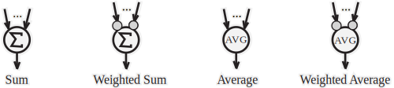
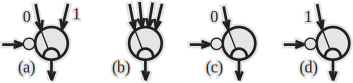
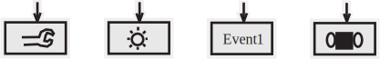
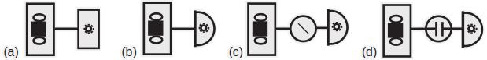
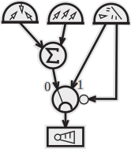
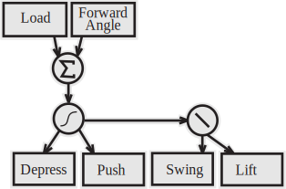
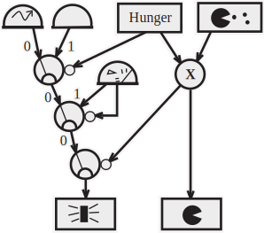

Nick Porcino – LucasArts, a division of the Lucasfilm Entertainment Company

This article presents Insect AI, a straight forward architecture, notation, and design methodology for agent design. Insect AI is a design tool for programmers and non-programmers alike, and can be easily tuned to generate specific behaviors.
Insect AI agents exhibit a number of interesting properties which satisfy the characteristics of motivated behavior as defined in the ethological literature - behaviors can be grouped and sequenced, the agents are goal directed, behavior can change based on the internal state of the agent, and behaviors can persist if stimuli are removed.
The agents are easy to implement, and are computationally inexpensive. Insect AIs have found their way into a number of games already [[Bombad01]](#Bombad01).

## As Smart as a Bug

John von Neumann observed that the description of intelligence might be more complicated than the system that realizes it [[von Neumann58]](#vonNeumann58). Instead of aiming for a complete system description or set of algorithms, Insect AI utilizes emergent behaviors - behaviors which have not been explicitly specified at the level of the system's implementation. Simple systems can generate complex behavior as the result of the interactions of reflexes and the environment [[Reynolds87]](#Reynolds87), [[Brooks86]](#Brooks86), [[Sims00]](#Sims00).
Insects demonstrate a wide variety of interesting and successful behaviors, yet their nervous systems are simple. A typical insect like a bee has around a hundred thousand neurons, about half of which are dedicated to the reduction of sensory information into useful signals. Of the remainder less than a thousand are motor neurons and even fewer are control neurons that moderate signals between the cerebral ganglion and the motor neurons. There are individual neurons that activate and deactivate specific behaviors [[Guthrie80]](#Guthrie80). It is possible to analyze behaviors in terms of simple computational units and create simulations of the behaviors. This approach is known as *computational neuroethology*.

## Computational Neuroethology versus Neural Networks

Although both Insect AI and neural networks attempt to mimic the functional success of biological nervous systems, Insect AI is not a neural network in the traditional sense. Typical neural network methods model large numbers of regularly connected identical neurons with no feedback. A learning method such as back propagation with gradient descent is performed on an associated Lyapunov energy function, and through this process a neural network converges on a solution.
In contrast, Insect AI circuits and behaviors are explicitly designed. Inspiration is taken from the study of simple invertebrate neuronal networks with small numbers of dedicated neurons whose interconnections are fairly easy to ascertain or deduce. Invertebrate neuronal networks are real time control systems, and are ideally adapted by Nature for successful survival behaviors, and are thus of interest to games programmers!

## Principles of Distributed Control

W.J. Davis contributed greatly to neuroethology [[Davis76]](#Davis76). He demonstrated how behaviors could be distributed across many simple units and listed several organizing principles, some of which are described here. These principles prove very useful when designing agents that are as smart as a bug.

- Command neurons, once activated, can invoke behaviors that outlast the original stimulus. A creature that creeps toward light can keep creeping even if the light is momentarily removed.

- The source of information should be connected as directly as possible to the units that use it. This keeps circuits simple and fast. A reflex circuit meant to draw a limb away from heat should be connected directly from the heat sensors to the actuators, without going all the way back to the brain (or an arbitrating algorithm or heuristic) for processing.

- Reflexes should self govern and run autonomously. In nature, neurons exist which suppress behaviors that would otherwise occur spontaneously. Severing a leech's cerebral ganglion from its nerve chord causes it swim continuously. The female preying mantis decapitates the male to elicit copulatory behavior [[Guthrie80]](#Guthrie80).

- Sensory feedback should be used to make behaviors self-calibrating. A leg controller doesn't need to be driven by an inverse kinematic solution, but instead can be driven by joint angle and load sensors.

- Specialization in a homogenous network can be maintained by controlling the circuit's relationship to incoming data, so the same circuit can accomplish different tasks simply by changing the inputs. A chase behavior could follow either a sound or a light by switching the input.

- Sensors with a non-linear response are particularly useful. If a joint angle sensor signals not an angle, but a response that increases non-linearly at the limits of motion, the signal functions analogously to pain. Such a signal can provide both an imperative signal to reflexes to compensate the motion, and input to a learning system that can adapt the reflex to avoid the pain signal in the future.

- Learning is distributed throughout the entire system, rather than localized in one place. If a limb is injured, local learning can adjust the motion of the affected limb, while the rest of the system continues to function normally. Reinforcement learning and Q-Learning work quite well in these systems [[Watkins89]](#Watkins89).

- Some behaviors are cooperative, but others must be hierarchical. An insect can balance behaviors such as *move to light* and *collect food*, but an escape reflex must override everything. Cooperative decision making can be implemented by a weighted sum of inputs. In a boid model both cooperative and hierarchical decisions are used. There are several reflexes: *avoid collisions*, *move to center*, *match speeds*, and *move to goal* [[Reynolds87]](#Reynolds87). While most of the reflexes can be summed since they all have similar behavioral priority, *avoid collisions* dominates in times of crisis by shutting off the other reflexes.

## Pattern Generation

So far we have examined reflex behaviors that are driven directly by environmental or command stimulus. Another category of behavior is characterized by the repetition of a sequence of events. Moving a leg, coordinating multiple legs, and patrolling a series of waypoints are all forms of pattern generation.
Surprisingly, patterns driven by pacemaker cells are rare in nature. Instead, neurons are connected reciprocally in pairs or groups such that each neuron inhibits its neighbor [[Laurent88]](#Laurent88). Every neuron tries to fire, that firing suppresses neighboring neurons, and patterns naturally arise as each neuron settles into an oscillation where it fires at a time maximally distant from the time its neighbors fire.
This pattern gives rise to one of the most common neural architectures in invertebrates - the ladder. Imagine a centipede with a neuron connected to each leg. Each neuron is connected to the neuron on the opposite side of the body, and to its fore and aft neighbors, forming a ladder of inhibitory links. This simple structure gives rise to the wave pattern commonly observed to move down the legs of a centipede, or the rippling wave seen in some fishes' fins. A ladder of six neurons is sufficient to generate all known straight line walking patterns observed in insects [[Porcino90]](#Porcino90). This circuit can be put to great use controlling the walking animations of many kinds of creatures and robots.

## Components of Insect AI

The following sections introduce the components of Insect AI and their notation. The primary design goal of the notation is that it be simple to remember, obvious to read in a diagram, and easy to draw in order that Insect AIs can be sketched out and revised rapidly. The components and their representations have been derived from practical experience earned over a great many AI design tasks by a number of people, including high school students! Implementation is straight forward and adapts easily to methods like C++ polymorphic objects, or streamlined SIMD-oriented data structures.

### Signals

Signals are the information flows between the components of Insect AI. All signals have an activation component, and may have other components as well, such as steering. In general, signals range between 0 and 1, or –1 and 1. No matter how many components a signal has, they are always indicated by a single line. If the direction of flow isn't clear, an arrow head can be used. If an Insect AI component has a control input, the activation component of a signal is the value that drives it.

### Sensors

Sensors can respond to any type of input or object in a game - power ups, player joystick inputs, the location of a team-mate, and so on. Sensors can be directional, or non-directional. An icon within the sensor indicates the quantity or object the sensor responds to. A directional sensor is denoted by a half circle, a non-directional sensor by a box.

Figure 1. Sensors are represented by an icon representing the sensed quantity. The semi-circle indicates a directional sensor, the box indicates a non-directional sensor. The sensor on the left senses the presence and direction of friendly agents. The sensor on the right detects only light magnitude.

Activation is a behaviorally significant quantity. A value of zero means no activity, 0.5 could be considered strong enough to pay some attention to, and a value of one would indicate maximum activation. Sensors can be tuned to indicate importance, a less important sensor could be clamped so that its output never actually reaches one.
The outputs of a directional sensor are *steering*, *pitch* (in a 3D environment), and *activation*. The non-directional sensor outputs *activation* only. The *steering* value ranges from –1 for hard left and +1 for hard right, with zero being neutral. An agent that can maneuver in three dimensions would also have a *pitch* value, with –1 being full pitch down, and +1 being full pitch up.

### Buffers

Buffers are used to introduce hysteresis and delay into an AI's behavior. The output of a buffer tracks the input at a rate determined by an adaptation constant and controlled by a simple linear interpolation equation. A buffer following a light sensor can prolong a light sensor's activation if the light is momentarily interrupted, allowing the AI to continue what it was doing for a few moments as if the light was still there.

Figure 2. Buffers provide a signal delay, the output of the buffer tracks the input. In this example, a light sensor's output is smoothed by a buffer.

### Sum and Average

Sum and average units provide simple mechanisms for consensus decision making. A weighted unit differs from an ordinary unit in that each input is multiplied by a different constant value before performing the sum or average. A convenient notational shorthand for the weights is to use small circles for less important inputs, and large circles for more important inputs. The weights typically need tuning by the programmer or a learning system, so an indication of relative importance is all the designer typically specifies during the design phase.

Figure 3. Sum and Average units. The small circles indicate weights on the inputs.

### Functions

In general, functions operate on the activation component of a signal. Many different functions are possible; multiplicative and threshold functions are very commonly used. The multiplicative function has a control input indicated by the small circle (see Figure 4), an input, and an output. Typical functions can compute inversions, Gaussian weighting, and so on. The icon within the circle is a simple graphical representation of the function. The number of inputs depends on the function being computed. Many useful gates don't have control inputs; this class of gates includes multiplicative constants, inverters, and threshold units.

Figure 4. Sample functions. In both, the signal enters at the top, is transformed, then output at the bottom. The signal input at the small circle is a parameter of the function.

### Switches

Switches have one or more input signals, an output, and most have a control input. Figure 5a shows a switch where a zero signal on the control input selects the left input, and a signal closer to one selects the right input. In order to reduce chatter, the switch selects 1 whenever the control signal rises above a value of 0.55, and 0 when the signal subsequently falls back below a 0.45 value. If no signal is present on a switch, the output is zero. That situation would arise on the switch of Figure 5c, which outputs a signal only if the control input is zero.

Figure 5. Some switches. (a) Two inputs, indicated by 0 and 1, selected by the control input on the small circle. (b) Winner takes all; only the signal with the highest activation passes through. (c) Passes the signal if the control input is zero. (d) Passes on one.

### Actuators

Actuators are output mechanisms. Actuators are always at the end of a signal, and are drawn as a box containing an icon indicating what it does. Besides the obvious motors and claws, a number of imaginative actuators are possible. Some examples are a steerable jet engine for boids, an output to a debugging monitor, and control inputs to a joypad -very useful for substituting an AI when no human Player Two is around.

Figure 6. Sample actuators. From left to right, they are a claw, a light, an abstract game event, and a motor with two steerable wheels.

## Some Examples

Valentino Braitenberg's pioneering book "Vehicles" introduced a number of key concepts in computational neuroethology [[Braitenberg84]](#Braitenberg84). Some of his vehicles are shown in Figure 7, redrawn using Insect AI notation.

Figure 7. Some Braitenberg style Vehicles. (a) light sensitive, (b) light seeking, (c) light avoiding – the function is an inverter, and (d) persistent light seeking.

The simplest agent we can create is one that links a Sensor to an Actuator. If a light magnitude sensor drives a motor, we create an agent that goes faster in response to increasing light levels (Figure 7a). If we link a directional light sensor to a steering input, the agent will drive straight toward a light getting faster as it goes (Figure 7b). If we put an inverting function between the light sensor and the motor, we get an agent that drives quickly out of dark spots and comes to rest near a light source (Figure 7c). Adding a buffer between the sensor and actuator will cause the agent to continue to move toward the light even if the light source is momentarily interrupted (Figure 7d). This type of mechanism can sometimes eliminate the need for trajectory prediction.

The famous boid flocking model [[Reynolds87]](#Reynolds87) has no global algorithm, rather, flocking boids make decisions locally in individual agents. The important contribution of the boid model was to show that cooperative group behavior could emerge in a system that didn't explicitly encode it. Cooperative group behavior is a characteristic of manifest interest to games programmers. Figure 8 shows a boid drawn using the Insect AI notation.

Figure 8. A simple boid. The sensors from left to right are *move to center of group*, *match velocity with neighbors*, and *avoid collisions*.

The *move to center of group* and *match velocity with neighbors* simply sum their outputs and pass them through to the motor. The *avoid collisions* sensor output is usually switched out, except when a collision is imminent.

## Implementation of Walking

Consider an insect's walking reflex. Insects have a variety of complex gaits ranging from one leg stepping at a time to a fast alternating tripod where three legs swing at the same time, leaving the other three in a stable configuration on the ground. Insects can negotiate arbitrary terrain, they can recover quickly from a fall, and they can continue to walk even after they've lost a leg.
A simple physics model and control circuit can make an agent walk over irregular terrain. The leg controlling circuit in Figure 9 is based on data in [[Laurent88]](#Laurent88), and was derived in [[Porcino90]](#Porcino90).

Figure 9. A leg controller. The *Forward Angle* sensor has a logarithmic response that increases the farther forward the leg moves, *Load* indicates a load sensor in the foot. Depress and Lift are actuators that raise and lower the leg, Push and Swing are actuators that push the leg to the rear, and pull it forward. The activation of *Load* and *Forward Angle* are summed. The function following the summation is a thresholding unit, the function on the right is an inverter.

The circuit is self starting provided as soon as the legs of the insect are bearing weight. The reflex works as follows:

- When the foot is first planted, the load sensor on the bottom of the foot contacts the ground, generating a *push* reflex that plants the foot more strongly and thrusts the body forward. It simultaneously suppresses the *swing-lift* reflex.

- Soon the leg is extended toward the rear of the animal. The leg is almost ready to lift and swing back. Other legs begin to carry weight; pressure on the load sensor is decreased. This gradually stops the *push* reflex and allows the leg to be lifted and swung forward in preparation for another step.

- When the lifted leg is swung all the way forward, the forward angle sensor starts the *depress* and *push* reflexes, which restarts the cycle at the first step.

This sequence is easy to create and tune because it is self limiting through the joint angle sensor, and self calibrating due to the load sensors in the feet - a leg won't be raised if it is still carrying a load. The logarithmic response of the *forward angle* sensor acts as a pain signal if the leg is swung too far forward ensuring that the leg will always get pushed to the ground to restart the cycle.
To generate a coordinate gait between several legs, a slightly more complex circuit is required. The Swing and Lift reflex must be suppressed by the neighboring legs' swing and lift reflexes to produce the ladder architecture described earlier in this chapter. The gaits that result are adaptive to the conditions of the physical simulation and biologically correct. A further enhancement to the circuit allows speed control on the *push* reflex. Adjusting the speed differentially between the two sides of the insect will steer it.

## An Artificial Cockroach

The cockroach of [[Beer89]](#Beer89), [[Beer90]](#Beer90) is a well studied Insect AI. This agent has two basic reflexes - *locomotion*, and *eating*. These reflexes are driven by a few switches and sensors. An internal energy monitor is most active when the insect is hungry, and there is a food sensor near the mouth. Both sensors activate logarithmically as per Davis' principles. Figure 10 shows Beer's cockroach reinterpreted using the Insect AI notation.

Figure 10. The artificial cockroach circuit. The sensors from left to right are *wander*, *move to food, avoid collisions, hunger,* and *food near mouth.* The actuators at the bottom are *locomotion* and *eating*. The function containing an "x" is a multiplier. The switch on locomotion passes the steering signal only when its control input is zero.

The *wander* and *collision avoidance* sensors are sufficient to allow the cockroach to make its way around obstacles and into new areas where food might be available. No explicit path finding is designed into the system. The output of *wander* is not tied to any environmental stimulus, it simply generates a time varying steering signal.
If the hunger sensor becomes active, *wander* is switched off in favor of *move to food*. When the agent is hungry and food is located, *food near mouth* activates the *eat* behavior and suppresses the movement reflexes. Eating continues until *mouth near food* becomes inactive, or until *hunger* becomes quiet.
This agent, although not much more complicated than a boid, exhibits goal directed behavior (find food when hungry) in addition to its reflexive behavioral repertoire (wander and follow edges). It groups and sequences behaviors (move to food, eat the food). It changes its behavior based on internal state (find food only when hungry). Behaviors persist if stimuli are removed (if food is removed, the insect will go looking for more food). The full behavior of this agent is not explicitly defined anywhere in the system, but instead emerges from the interactions of simple behaviors and reflexes.

## Conclusion

Insect AI opens the door to using results from the neuroethological literature, and can be used to create agents that are as smart as a bug. The Insect AI methodology has proven itself flexible and easy to use. The resulting agents are robust, and computationally efficient. The notation is easily extensible to accommodate the particulars of a new game or simulation feature, and is easily mastered by non-programmers.

## References

**[Beer89]** Beer, Randall D., Chiel, Hillel J., and Sterling, Leon S., "Heterogeneous Neural Networks for Adaptive Behavior in Dynamic Environments," in *Advances in Neural Information Processing Systems*, vol. 1, Morgan Kaufman Publishers, 1989

**[Beer90]** Beer, R.D., *Intelligence as Adaptive Behavior*, Academic Press, 1990

**[Bombad01]** Lucas Learning, *Star Wars Super Bombad Racing*, 2001

**[Braitenberg84]** Braitenberg, Valentino, *Vehicles: Experiments in Synthetic Psychology*, MIT Press, Cambridge, 1984

**[Brooks86]** Brooks, Rodney A., "A Robust Layered Control System for a Mobile Robot," *IEEE Journal of Robotics and Automation*, vol. RA-2, no. 1, March 1986, pp. 14-23

**[Davis76]** Davis, William J., "Organizational Concepts in the Central Motor Networks of Invertebrates," in *Neural Control of Locomotion*, R.M. Herman, S. Grillner, P.S.G. Stein, & D.G. Stuart (Eds), Plenum Press, New York, 1976, pp. 265-292

**[Guthrie80]** Guthrie D.M., *Neuroethology: An Introduction*, Blackwell Scientific Publications, Oxford, 1980

**[Laurent88]** Laurent, Gilles, and Hustert, Reinhold, "Motor Neuronal Receptive Fields Delimit Patterns of Motor Activity During Locomotion of the Locust," in *Journal of Neuroscience*, vol. 8, no. 11, Nov. 1988, pp. 4349-4366

**[Porcino90]** Porcino, Nick, "A Neural Network Controller for Hexapod Locomotion," in *Proceedings of the International Joint Conference on Neural Networks*, San Diego, 1990, pp. I-189-194

**[Reynolds87]** Reynolds, Craig W., "Flocks, Herds, and Schools: A Distributed Behavioural Model," *ACM Computer Graphics (Siggraph)*, vol. 21, no. 4, July 1987, pp. 25-34, [www.red3d.com/cwr/boids](http://www.red3d.com/cwr/boids)

**[Sims00]** Maxis, *The Sims*, www.maxis.com, 2000

**[von Neumann58]** von Neumann, John, *The Computer and the Brain*, MIT Press, 1958

**[Watkins89]** Watkins, C., *Learning from Delayed Rewards*, Thesis, University of Cambridge, England, 1989
