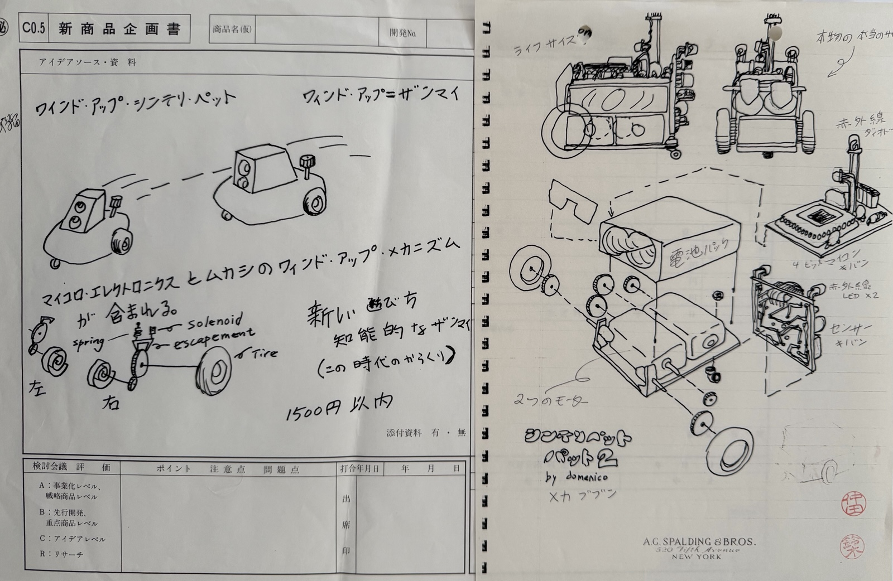
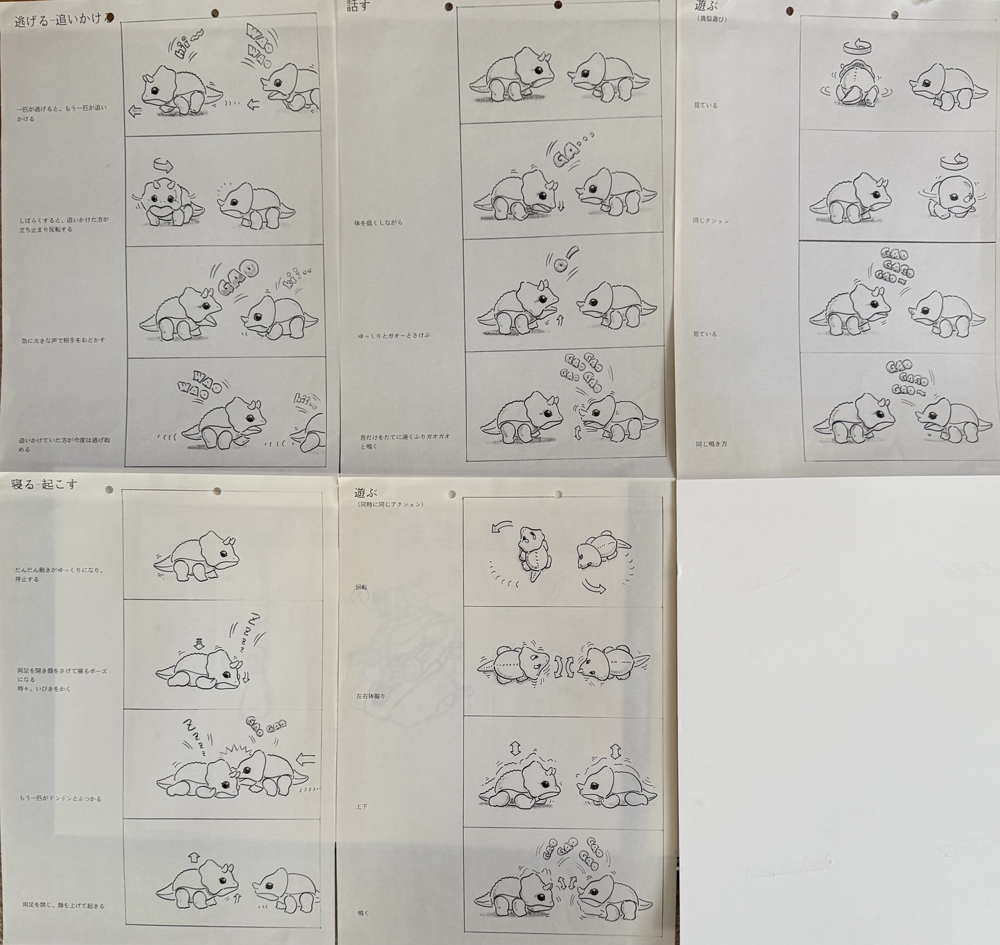
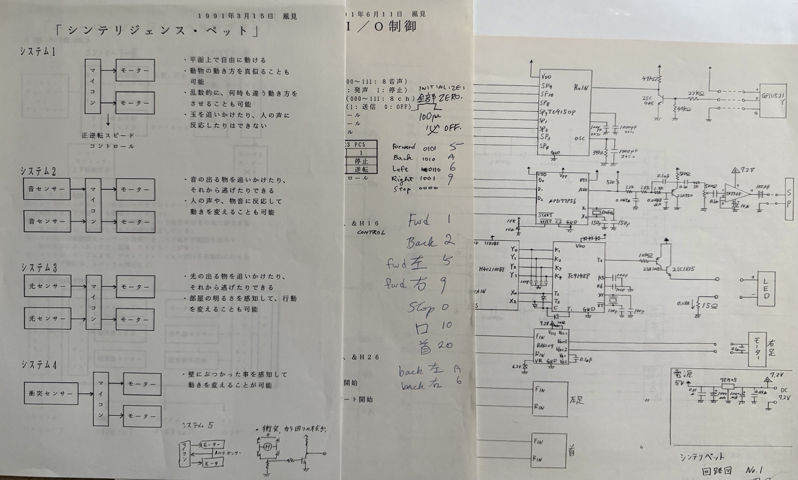
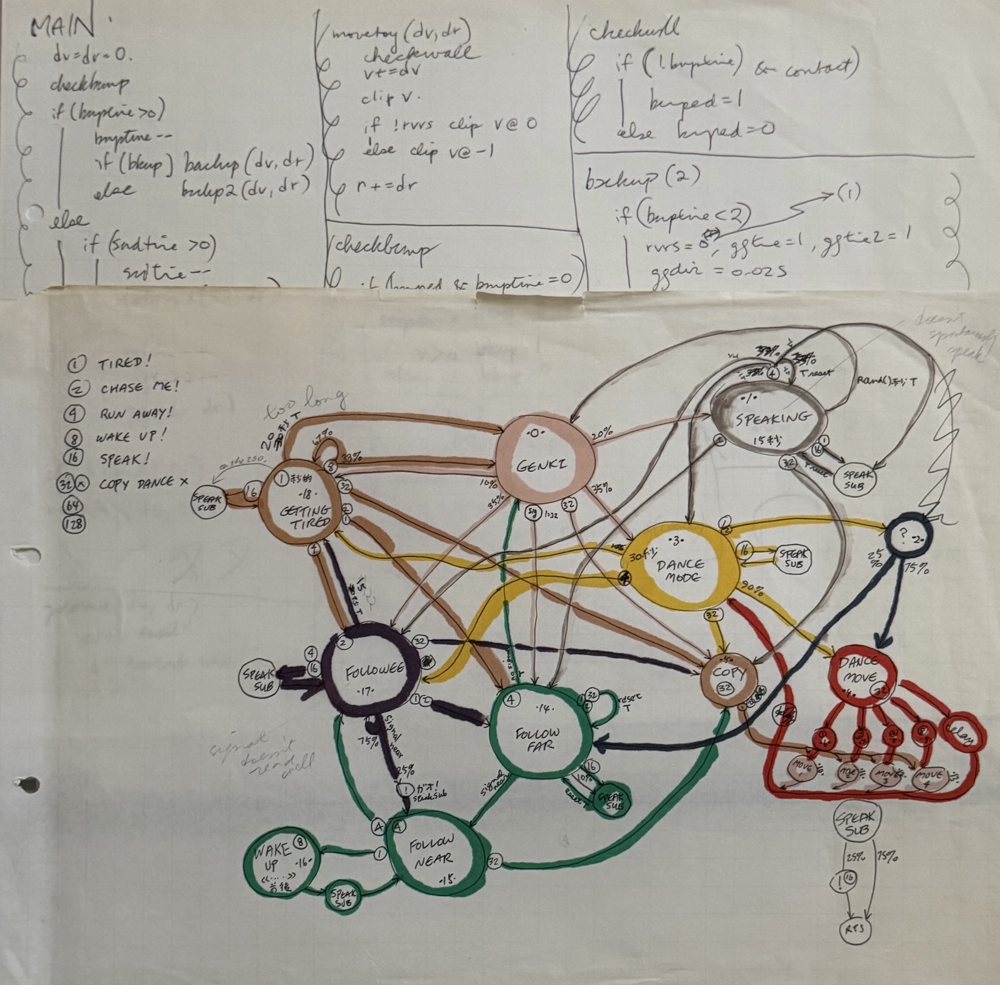
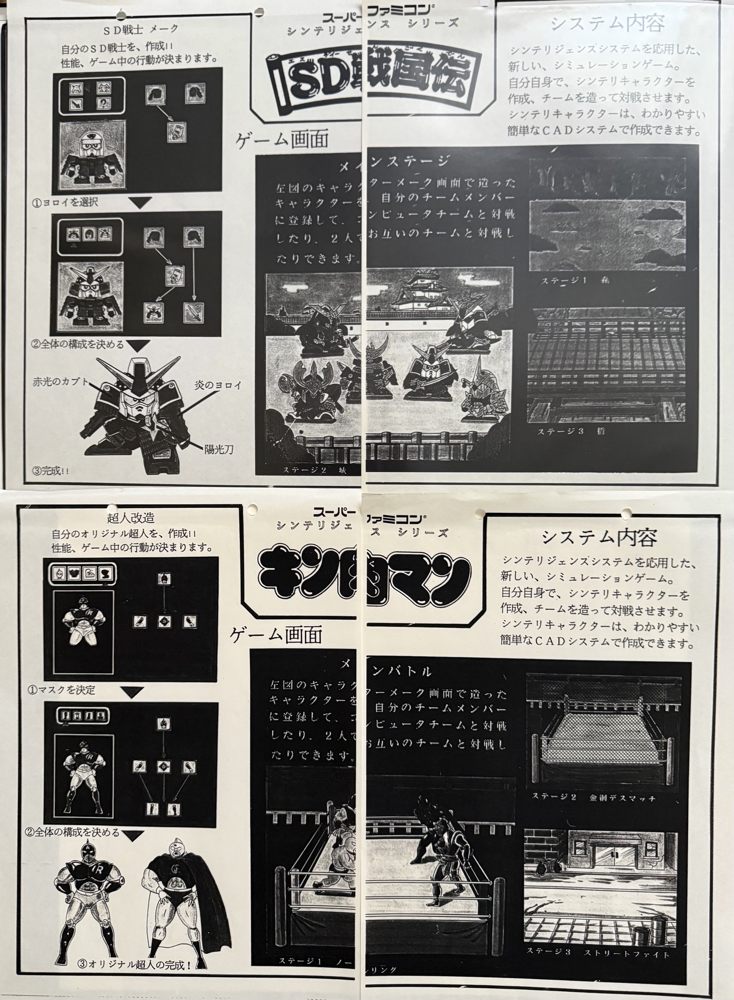
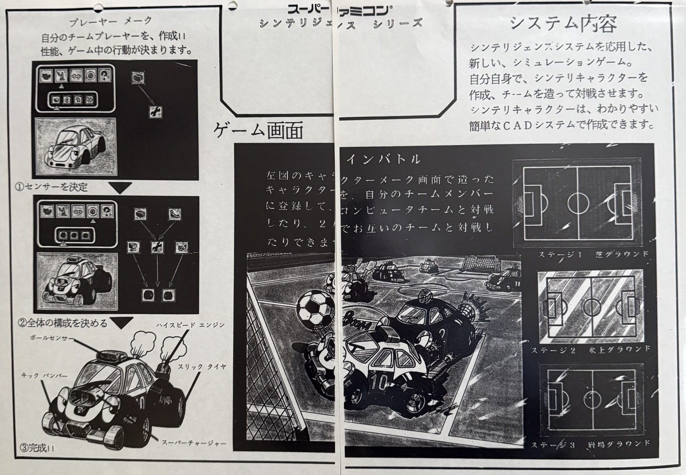
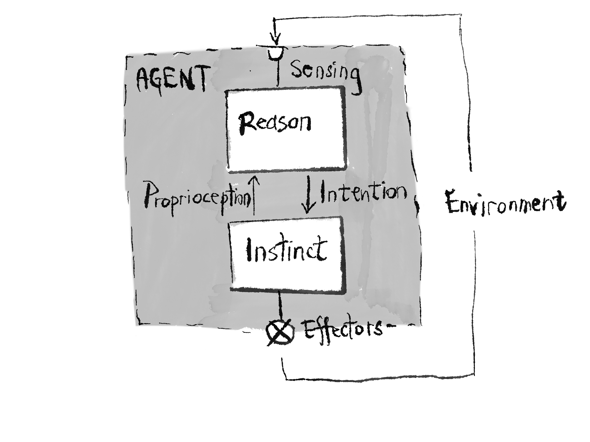

---
title: "Synthetic Intelligence: Distributed Control of Intelligent Systems"
description: "Syntelligence architecture from 1990-present"
pubDate: 1990
tags: ["distributed control", "neural networks", "subsumption", "Braitenberg", "games", "artificial intelligence", "robotics", "mechatronics", "neuroethology "]
author: "Nick Porcino"
draft: false
---

# Synthetic Intelligence, 2026 Edition
## Syntellipet and the Distributed Control of Intelligent Systems

(c) 1990-2026 Nick Porcino

**LLM disclosure**: This article was written by hand and brain. For the 2026 edition, an LLM was used for spell checking, for identifying category errors and other intellectual faults, to verify that references in the article are used appropriately in context, and to check that credit to original ideas is given where it is due by asking for prior research references on related topics. All self-indulgent flowery prose, malapropisms, mistakes, and misunderstandings are my own.

## Introduction

This article has appeared in various editions on the web since the early 1990s. It grew out of a formalization of research by the author for a "Synthetic Intelligence Pet", a so-called Syntelligence Pet, or a **Syntellipet**, conducted in 1990 at the Strategic Research & Development Group of **Bandai**, in Kanda Tokyo while the author was a visiting researcher.

Originally meant to be a revolutionary toy, possibly one of the first to embed a CPU for general intelligence, the syntellipet would have been a small, cute robot driven by a neural network controller modulated by basic needs such as hunger, fatigue, curiosity, and happiness. The Syntellipet was a Braitenberg **Vehicle**, a machine where complex behavior emerges from simple sensor-motor connections rather than a central "reasoning" hub. In those days embedding a CPU of any complexity in a toy was rare and challenging, and lightweight neural processing offered an avenue to complex behavior exceeding what be accomplished with pure proceduralism.

Various embodiments were explored. In Figure 1, on the left, a clockwork escapement is combined with a small microcontroller to create a smart wind up toy. On the right, a more sophisticated variant is proposed optimized to embody as much sensing and actuation as possible in the smallest possible package. The fundamental size constraint in the design was the dimensions of the AA battery most typically used in toys at the time; as a matter of fact, the size and density of the energy supply is always the primary concern when making small products.

Behavioral schemata were designed for the Syntellipet. Figure 2 shows a number of explorations: Syntellipets involved a game of tag, a spontaneous conversation, play, sleep and wake, and a playful dance. 

The robot prototypes communicated via infrared signalling in order to enact these coordinated behaviours. Circuitry and prototype robots were built and extensively iterated, each iteration making the total technology package smaller.

In the vein of Braitenberg's Vehicles, a behavioral schematic was constructed and translated to code that could run efficiently and effectively on the microprocessors of the time.

Once the hardware prototype existed, it quickly became clear that iteration, involving first compiling the software on a PC9801, transferring it via RS232C serial communications to an EEPROM burner, "burning" a ROM, and then debugging was a hindrance to innovation and iteration; a simulator, in a custom realtime visualization engine made for the purpose was the obvious solution. The visual development of the Syntellipets shows a clear trend towards a familiar product (Figure 5).

An editor for the pets' mind was created. The development took a turn when it was noticed that the simulation of the toy looked an awful lot like a video game, and the idea of a Super Famicon game cartridge with a battery and real time clock took hold (Figures 6a, 6b). The pet, no longer embodied in a robot body would be awake when inserted in the game console, and the player would take care of it. It's mind would be persistent.

Someone suggested that if a screen were to be attached to the cartridge, and some buttons, there'd be no need for a game console, and kids could carry the pet with them everywhere. The project migrated then from R&D to product development, where the concepts found a home. Aki Maita was already intrigued with the concept of a "pet that could be carried around," based on her observations of Japanese schoolchildren, and the rest is history, the **Tamagotchi** project has had a profound impact on the way we think about toys and interactivity that continues today.

The architecture described herein is directly descended from that original research, and the author continues work on this style of artificial intelligence, known as computational neuroethology, to this date. Since then the architecture has been deployed in other projects, such as **Star Wars Super Bombad Racing** (Lucas Learning, 2000), and described in textbooks such as the **AI Game Programming Wisdom** series.

### The Complexity Trap

At the time of the original writing, 1990, AI had advanced as far as it had through the successful application and exploitation of **reductionism**. John von Neumann had observed that if something can be described precisely enough in A implies B language, it can be programmed [^von-neumann-1958]. The implication was that any task could be decomposed into fine enough steps that automation could be achieved. Early practitioners of AI soon discovered that the complexity of such a task decomposition quickly becomes monstrous for a task of any significance. The difficulty, or even the impossibility, of making precise enough system descriptions is the **Complexity Trap**.

> It took several years for us and our students to develop *Move, See, Grasp*, and hundreds of other little programs we needed... The project left us wondering if even a thousand microskills would be enough to enable a child to fill a pail with sand. [^Minsky-87-2-5]

In the early 1960's, Marvin Minsky and Seymour Papert built a robot whose task was to use a robotic hand to copy children's building block structures it saw through its camera.  As they broke the block-world task down, complexity was revealed onion-like. At first, the task decomposition was fairly straight forward: find the small red block, find the green block, put the red block on top of the green one. The lurking complexity is revealed at the next level of decomposition: "find the small red block" becomes a question of selecting one object among many in the environment and discriminating basic qualities, such as "block", "red", and "small". The vision task breaks down into smaller and smaller steps until it finally reaches the level of basic manipulation of bit-mapped figures.

Every subsequent and associated task individually unfolds into smaller tasks each revealing more complexity and onion layers. The robotic arm might need to move a block out of the way to allow an obscured block to be grasped, and then the tasks would have to be re-ordered to allow progress to proceed; aligning one block's center of gravity over the others is an another task, and so it goes. The resulting combinatorial explosion seemed completely unlike the problem solving methods of natural intelligence. The functions of human intelligence which we consider the highest (such as logical reasoning) were found the easiest for a computer to do. Integral calculus and logical proofs can be easier to program than "simple" tasks like distinguishing a circle from a square because at the lowest levels the calculus problems are logical operations on strings of symbols, whereas distinguishing circles from squares involves more difficult problems such as the fundamental representations of concepts and geometries.

Hans Moravec later called out the paradox:

>> "It is comparatively easy to make computers exhibit adult level performance on intelligence tests or playing checkers, and difficult or impossible to give them the skills of a one-year-old when it comes to perception and mobility."

These issues led leading Minsky and Papert to propose that the mind might be composed of a number of semi-autonomous agents that solve these problems through their interactions, in a so-called **Society of Mind**.

Hierarchical task decomposition, the traditional foundation of AI and programming in general, limits behavioral repetoire and flexibility. Linguistically, we characterize "robotic" motion as simplistic, rote and repetitive. Early researchers built on the Society of Mind concept in attempts to create behaviour that might break out of the robotic mold.

The hierarchical **Subsumption Architecture** of Rodney Brooks [^Brooks-1986] was a decisive step towards a robust methodology for distributed control. The Subsumption Architecture proposed that tasks could layer their complexity; the most basic behaviors would exist at the deepest levels of the system, and more complex behaviors would be in layers above those. The more complex layers would be activated as certain conditions were met, and would "subsume" the behavior of the lower levels as long as those conditions were valid. A low level behavior might be *Steer Towards Light*, and a higher level behavior might be *Stop and Recharge*. When *Stop and Recharge* is active, it would suppress, by subsumption, *Steer Towards Light*.

Each layer in a Subsumption machine is an independent sense-act loop. This was Brooks' rejection of the traditional vertical sense-model-plan-act pipeline. As each layer in the hierarchy activates, it subsumes the layer below it, taking over the sense-act behaviours. Unfortunately, as task complexity increases, the Subsumption Architecture falls victim to the same complex task decomposition and higher level design problems as the traditional methods. A consequence of the Subsumption Architecture's nature - it is non-deterministic, entirely state-driven, and does not incorporate memory of actions - is that it cannot carry out predetermined sequences of actions. Bellingham [^Bellingham-1990-1, 2] studied that problem and modified the Subsumption Architecture to include scriptable behaviors.

Nagata et al in Japan proposed an alternative solution to the hierarchical control problem in reactive architectures in 1990 [^Nagata-1990]. The difference in character between autonomous, strictly reactive reflexes and the more complex behaviours which are a result of the interactions of lower level reflexes suggests a functional split for the proposed architecture. As shown in the following figure, their architcture splits the control problem into two parts: a **Reason** module, and an **Instinct** module. **Reflexes** implementing simple or atomic tasks are arranged within each module (not shown in the diagram). The Instinct module implements those basic behaviors such as *Steer Towards Light* for which any of the common reactive architectures excel. The Reflexes in the Instinct module can affect the environment directly, and also outputs a self-awareness vector encoding its activity. The Reflexes in the Reason module monitor the self-awareness vector and the environment, and output an **Intention** vector that selects amongst the behaviors carried out by the Instinct module. The Reason module thus cannot affect the environment directly.

## Insect AI 3

Insect AI 3 is not so much a new architecture for distibuted control as it is a conceptual framework to facilitate the development of intelligent systems with a high degree of flexibility in their operation and in their interactions with underspecified environments. It embodies several high level concepts which taken together offer a way out of the Complexity Trap.

Insect AI:

- Distinguishes between high level behavioural control (meta-reflexes) and low level reflex behaviours
- Recognizes that complex behaviours may be the result of a complex environment
- Emphasizes the distinctions between external environment sensing, intention, self-awareness, and peripheral sensing
- Mimicks the functional success of biological nervous systems
- Specifies that behaviours must be self-calibrating
- Promotes consensus decision making rather than absolute control by individual sub-systems
- is based on the idea that behaviours and systems are reciprocally related, more than hierarchically related

The use of the proposed architecture is demonstrated by Network 1 which accomplishes the task of multi-robot coordination, and by Network 2, the artificial insect controller of (Beer, et al, 1990)[^Beer-1990] whose architecture is isomorphic with the work presented here.

Insect AI 3 builds upon the reason/instinct architecture, adding a **Desires** automaton to the **Reason** module to sequence behaviors by controlling the **Intention Vector**. Insect AI 3 combines the ideas of the Subsumption Architecture, neural network control, and behavioral sequencing. The **Reason** module acts as a modulator rather than a commander. In traditional AI,  "reasoning" tells the legs how to move. In Insect AI 3, **Reason** tilts the **Instinct** module's goals via the **Intention Vector**, see Figure 7.

### Complex Behavior arises from the Environment

Von Neumann warned that the full description of a system's behaviour may be more complex than the system itself [^von-neumann-1958-2]. Complex behaviour may be the result of a complex environment [^Brooks-1986-2], and finally, the observation that the world is its own best model. Insect AI 3 does not aim for a system description which must almost necessarily be incomplete. Instead simplex reflex arcs subserving low level behaviours are designed, and feedback is introduced to modulate the interactions of the behaviours. The resulting system exhibits so called "emergent behaviours" - behaviours which have not been explicitly specified at the level of the system's implementation. 

### Internal and Peripheral Senses

Following Nagata et al[^Nagata-1990-2], Insect AI 3 splits a system into an "instinct" module where all the simple reflexes exist autonomously, and a "reason" module comprised of what are essentially meta-reflexes operating in reaction to both signals from the instinct module and to environmental stimuli. The reason module sends an intention vector to the instinct module to modulate the low level reflexes.

Development of Insect AI 3 architectures incorporating the reason-instinct split revealed that the two modules can be characterized in terms of the sensory modalities appropriate to each module. Some senses such as hearing and vision are specific to the external environment. Other senses are internal, for example, feedback about the state of low level reflexes, and proprioceptive sensing such as force feedback from a manipulator.

Whereas external senses are of primary importance only to the reason module, the internal senses must be divided into a self-awareness vector for the reason module, and peripheral senses for the instinct module. The self-awareness signals are the means by which the reason module's meta-reflex can monitor (be aware of) the activity of the reflexes in the instinct module. The peripheral senses and intention vector drive the instinct module, which in turn controls the effectors, completing the loop by providing a means whereby a robotic or other intelligent system can modify, and be modified by, the total environment. Refer again to Figure 5.

The Insect AI 3 architecture is modelled after the invertebrate nervous system. The __reason__ module is analogous to the invertebrate's cerebral ganglia, the __instinct__ module corresponds to the thoracic or sub-cerebral ganglia. The __intention vector__ is the means by which __meta-reflexes__ control __reflexes__, and the __self-awareness vector__ allows the reflexes to influence the meta-reflexes.

### Neural and Neuronal Networks

The study of neural and neuronal networks are important to the architecture as a quick glance at the references reveals. Insect AI 3 grew out of a study of **invertebrate nervous systems** and the application of **neuromimetic computational architectures** to intelligent systems control [^Porcino-1990][^Porcino-Collins-1990]. Invertebrates exhibit a high level of sophistication despite the relative simplicity of their nervous systems, and thus pose a significant challenge to researchers[^Cliff-1990].

Invertebrate neuronal networks are self-calibrating - an insect can adapt to changing conditions such as the state of the environment, or changing morphology such as losing a leg. This is a characteristic shared with behaviours intended for the Subsumption Architecture. Invertebrate neuronal networks are very much like adaptive control systems, and are ideally adapted by nature for real-time control.

Artificial neural networks attempt to mimic the functional success of biological nervous systems. Most neural network methods attempt to model large numbers of regularly connected identical neurons with no feedback. Typically gradient descent is performed on an associated Lyapunov energy function, and through this process a neural network converges on a solution. Traditional neural computational structures are only now beginning to demonstrate some competence in the termporal domain, but they are still unwieldy as they usually treated as functional black boxes with well defined input-output relations - signals are pipelined straight through with no internal feedback.

In contrast, the approach taken in the development of Insect AI 3 differs in that inspiration was taken from the study of simple invertebrate neuronal networks which in general have small numbers of dedicated purpose neurons whose interconnections are fairly easy to ascertain or deduce.

### Distributed Control By Invertebrate Neuronal Networks

Returning again to von Neumann's warning about complexity, we can deduce that if the full description of a system's behaviour is more complex than the system itself, it follows that many abilities will not be directly specified in a full system description. In other words, complex behaviours emerge from the interactions of environment and the simpler elements making up the system. 

Theoretical system models often capture the flavour of some small aspect of a system's behaviour, but these models usually consider only very restricted contexts (cf. Guthrie, 1980[^Guthrie-1980]). In actual fact the sheer multiplicity of behaviours and interactions between behaviours is natural organisms are too complex for full description. Similarly, the behaviour of useful intelligent systems is equally hard to describe.

Most current robotic systems operate in highly constrained environments such as the factory floor where only small numbers of predefined task need be performed on certain types of objects. The environment can be explicitly controlled; precisely defined objects are found only in specified places, thereby facilitating reliability, determinisim, speed, and operational efficiency. It is far easier to describe a very restricted environment and the behaviours possible in that environment than it is to specify open-ended real world systems.

Nonetheless, modern intelligent systems have to deal with humans and more natural, less well-behaved environments. Inspired by the evolutionary progress of natrual systems, the neuro-mimetic computational structure is highly parallel, locally simple, and robust in the face of unexpected situations or even systemic failures. In natural nervous systems, no single processing unit controls behaviour - there is a progression of behavioural complexity beginning with the basic reflex arcs governed by a relatively small group of neurons (behaviours such as simple rhythmic motions or withdrawing from aversive stimuli), and ranging to the more complex behaviours governed by the higher nuclei and cortex (such as feeding and social interaction).

Natural nervous systems are reciprocally connected and build consensus (Figure 3). They exhibit simple stereotyped behaviours generated by simple reflexes, and the interactions of simple reflexes lead ultimately to sophisticated behavioural repetoires. These concepts for distributed architectures lead to the following axioms:

- Redundancy and Robustness result because responsibility for any particular behaviour resides in no single unit
- Self Calibration of Behaviours occurs through tight sensory feedback
- Behaviours outlast the triggering stimulus through the action of feedback signals
- Command locus near the site of incoming information maximise processing speed and minimize connection lengths and communication times[^Davis-1976]
- Specialization of units near sensory input is due to self organization of neural circuits in reaction to patterns in sensory input[^Davis-1976-2]; and
- Optimization and self adaptation of behaviours results from cooperation and competition between units[^Klopf-1988][^Grossberg-1987]

### Reflexes and Meta-Reflexes

If the head of an insect is severed, reflexes governed by ganglia lower than the cerebral ganglia are often released. Leeches swim continuously. Cockroaches walk spontaneously. Nereis will spontaneously creep, and it no longer withdraws if tapped. Female mantises bite off the head of the male to disinhibit copulatory behaviour. It seems that meta-reflexes in the cerebral ganglia control the reflexes of the lower ganglia. The reason-instinct split is suggested by this commonly observed nervous organization.

The utility of meta-reflexes is simply illustrated by an example. One of the most apparently complicated behavioural displays is the group action of a large number of organisms, whether it is the flocking of birds, the schooling of fish, the milling of crowds, or the herding of mammals. When a flock of birds wheels overhead, it seems there must be some sort of central coordinating intelligence or some wonderfully complex communication system to allow all the birds to swoop and swirl around each other without ever crashing, or for all the birds to begin a turn in the same direction at almost the same time.

As it turns out, no "super" control or communication is necessary. The flocking behaviour can be imitated by a very simple controller local to every member of the flock. Consider Network 1 (Figure 4). This behavioural controller, cast in Insect AI 3's mold, is reminiscent of Braitenberg's Vehicles[^Braitenberg-1984] and Reynolds' Boids[^Reynolds-1987]. Figure 5 shows the behaviour of simulated vehicles using the controller. Notice that in general the vehicles attempt to reach the goal, but swerve to avoid collisions. A number of similar examples in three dimensions can be found in a later Boids paper[^Reynolds-1997] and Wilhelm and Skinner, 1990[^Wilhelm-1990]. The Wilhelm and Skinner paper elaborates on an interactive design system for Boid architectures, called Notions.

The robots are given simple bodies equipped with some means of locomotion - wheels or legs, and some rudimentary senses. In Figure 3, sensors are drawn in left-right pairs pointed a few degrees off center. Each half of a sensor pair is sensitive to stimuli that are strongest in the direction the sensor is pointing. As the stimuli is moved off the sensor's axis, sensor response falls off logarithmically. This sensitivity pattern assures that the sensor whose axis passes nearest the stimuli will respoind the strongest. If a stimuli is "dead ahead, " both sensors respond equally. Logarithmic sensor response is used throughout the Architecture. Sensors are designed so that behaviourally significant states evoke a high resopnse, but response falls off quickly as the significant state is left. Logarithmic sensor response ensures that significant states evoke an impreative signal to reflexes and meta-reflexes[^Porcino-1990-2]. The highest activations of a sensor indeicate the most imperative conditions in a fashion analogous to pain. This analogy points the way to learning in these circuits, perhaps using drive-reinforcement learning as described by Klopf [^Klopf-1988-2].

Consider the instinct module of Network 1. Locomotion receives peripheral sensing signals specific to the mode of locomotion - for example, slip sensors for wheels, load sensors for legs. In addition, locomotion receives an intention vector consisting of a turn left magnitude, and a turn right magnitude. Based on the difference between the two inputs, the robot turns and moves forward.

The reason module introduces the concept of "consensus decision building." The intention vector is the sum of the sum turn left and sum turn right processes. These processes simply pass on a weighted sum of their inputs, the simplest possible form of consensus. The inputs on the sum turn processes come from three meta-reflexes: avoid collisions, move to center, and move to goal. Move to goal is defined according to Reynolds[^Reynolds-1987-2]: it attempts to move a flock member to the center of its nearest flockmates and also to match the average velocity of the nearest flock mates. Move to goal causes a taxis towards some "homing" point that can be used to steer and direct the flock. Avoid collisions steers a flock member away from imminent disaster. Avoiding collisions has the highest behavioural priority, so avoid collisions ensures that its outputs dominate sum turn in times of crisis by shutting off the other two meta-reflexes. On the other hand, neither move to center nor move to goal is more important than the other, so sum turn forms a consensus between the two.

### Self Awareness

Network 1 illustrates the use of reflexes and meta-reflexes. It is ia controller which could be easily implemented by Levels 0, 1, and 2 of the Subsumption Architecture (Figure 6). Like the Architecture presented here, the Subsumption Architecture makes use of networks of simple interacting reflexes[^Brooks-1986-3]. Higher level Subsumption Architecture behaviours supproess lower level behaviours and take over their functionality in a process called "subsumption." Lower level behaviours can never suppress higher level behaviours. In contrast, the Architecture presented here avoids a hierarchical arranagement by introducing the Self-Awareness feedback vector, which allows the emergence of interesting behaviour.

Secondary sensing provides the system with phenomological awareness; or at least, the epistemological seeming of phenomenological awareness. A toy might slow, and investigate some aspect of the immediate environment, behavior we might ascribe to curiosity; as a phenomenonological vector, curiosity emerges trivial from a decay function modulating the activation of a "wander" reflex. The appearance of "happiness" may emerge via a combination of a curiosity affect, repetitive cognitive activation responding to the appearance of a ball in the visual field, and activation of secondary mechanisms such as a wagging tail.

### Limitations of the Subsumption Architecture

The principal advantage of Subsumption is that low level behaviours can be readily designed and implemented, and subsequencty layers can be added on top of the correctly functioning lower levels. Unfortunately, there are some implicit problems with the Subsumption Architecture which have been addressed with varying degrees of success:

- Since the Subsumption Architecture's hierarchical structure is strictly reductionist, the higher level behaviours fall victim to the task decomposition problems inherent in the Complexity Trap [^Brooks-1986-4]
- It is completely reactive to the environment: its behaviour is nondeterministic and entirely state-driven
- It does not incorporate memory of actions and so cannot carry out predetermined sequences of events [^Bellingham-1990-3]

The Architecture presented here addresses these problems through the introduction of the self awareness vector and by allowing reflexes and meta-reflexes to work through reciprocity instead of hierarchy. In order to illustrate these principles we willl consider the simulated insect behavioural controller of Beer, Chiel, and Sterling[^Beer-1989]. This controller has been selected because it is isomorphic to the Architecture presented here (Network 2, Figure 7). The behaviour of this controller is well understood and exhibits a number of properties which suggest that controllers using similar architectures might be suitable for the control of other intelligent autonomous systems.

The basis reflexes of Network 2 are the locomotion and chewing reflexes, these suggest the two basic behaviours of the simulated insect: moving around and eating. The reciprocally connected meta-reflexes are eat, move to food, follow edges, and wander. The simulated insect's instinct module has an internal energy monitor which watches the energy level of the insect. Like the senses of Network 1, the energy monitor has a logarithmic response, becoming most active in the most behaviourally significant state: when the internal energy state is low, the insect is "hungry."

To embody apparent behaviors and motivations in systems that must be expressive, such as toys or animated characters, emotions themselves become expressed in this system as cumulatory activation signals. Emotions become **Global Regulatory Variables**.

As the insect gets "hungry" the eat and move to food meta-reflexes become more and more active. Move to food suppresses follow edges, although wander continues to be active. Move to food operates in the same way as the move to goal reflex of Network 1, that is, by following "scent" gradients detected by two antenn・ When "food" is found, the sensors in the mouth activate the chew reflex. The chew reflex in turn suppresses the move to food reflex and allows the eat reflex to become active which further suppresses move to food. Eating continues until the internal energy level is saturated, at which point the internal energy monitor becomes inactive, releasing the follow edges behaviour from inhibition. Eat and move to food also become inactive.

This controller is somewhat similar to systems implementing competence levels 0, 1, and 2 of the Subsumption Architecture. However, the low levels of that architecture are strictly reactive to environmental stimuli. This controller, although no more complex than a simple Subsumption Architecture system exhibits goal directed behaviour in addition to its reflexive behavioural repetoire - it searches for "food" whenever the internal energy store is low.

Network 2 uses reciprocity and consensus to reach decisions. A hierarchy is simpler to analyze and perhaps simpler to program, but it drastically limits the complexity of the behaviours a system can exhibit. Unlike the Subsumption Architecture, Network 2 exhibits several of the characteristics of motivated behaviour:

- The controller groups and sequences behaviours (to obtain food when hungry);
- It is goal directed (it generates movements which serve to find food);
- It exhibits changes in behaviour based upon an internal state (it attempts to find food when hungry, and ignores food otherwise);
- Behaviours can persist if stimuli are removed (if food is removed or runs out while the insect is eating, appetitive behaviour persists.

Simulation shows that the distributed nature of the system allows it to cope with complex and underspecified environments[^Beer-1990-1]. As we have come to expect from neuromimetic systems, if the system is damaged, performance degradation is gradual[^Chiel-1989]. Note especially that the full behaviour of the system is not explicitly defined anywhere in the system, emerging instead from the interactions between simple behaviours. Through the principles of emergecne, the Complexity Trap is avoided.

### The Desires Automaton

To be fully practical, a control architecture must be able to specify exact sequences of behaviours, both in order to achieve goals that require sequential satisfaction, and also in order to avoid a 'dithering' effect where an agent becomes trapped between competing stimuli. The "**Desires**" module is introduced in order to extend Level 1 with abilities beyond trivial reactivity. It accomplishes this by acting effectively as a stored sequence generator. Its action is to activate specific meta-reflexes then wait for a terminating condition to be satisifed, at which point it activates another set of meta-reflexes. The name desires comes from the fact that the automaton acts through the self-awareness vector to tell the meta-reflexes what the "want" to do next. The simplest mechanism to implement the desires automaton is a finite state machine or a Petri net.

It functions by monitoring the Self-Awareness Vector and environmental stimuli against pre-set internal thresholds. Once a desire (such as 'Foraging') is activated, it latches. This latching mechanism ensures that the system maintains a persistent Intention Vector until a termination condition is met (e.g., energy saturation). This provides the "behavioral momentum" observed in natural organisms, where a predator will continue a chase even if a minor distraction occurs.

The desires automaton has its biological precedent in the low level behavioural sequence reflexes of invertebrates which simple mindedly carry out complex tasks such as taking steps, building webs, spinning cocoons, bring prey back to a nest, mating, and so on. It seems that many of these tasks are sequenced by ganglia at a level lower than the cerebral ganglion and thus appear to be reflexes controlling meta-reflexes. These meta-meta-reflexes foreshadow the "association" module of Level 2.

### Level 2: The Associative-Experiential Layer.

Level 0 implements a simple "reactive now" of Level 0. In Level 1, the agent is a slave to its current drives. In Level 2, the agent becomes a subject of its own history. The "obvious" solution is a cybernetic loop, but the complexity lies in the regulation of the agent's internal model of the world to ensure it matches reality, while simultaneously managing the "affective" cost of that modeling. Level 2 is thus an **Epistemic Homeostatic Controller**.

Level 2 introduces the **Association-Experience Module**, analogous to the vertebrate cortex. While the **Instinct** and **Reason** modules handle the mechanics and intentions of the present, Level 2 governs the meaning of the past and the expectation of the future. It is here that the system transitions from a sophisticated automaton to a persistent "self."

### Epistemic Homeostatic Control

At the core of Level 2 is an Epistemic Homeostatic Loop. Traditional cybernetics focuses on maintaining physical variables (temperature, energy). Epistemic homeostasis, however, seeks to maintain the integrity of the agent’s internal predictive model. The system constantly compares the incoming Self-Awareness Vector ("what I am doing") and External Senses ("what I perceive happening") against a predicted state generated by the Association Module.

Congruence is a messure of the prediction versus reality:

* Congruence: If the prediction matches reality, the system is in a state of high confidence (subjectively: "Calm" or "Flow").
* Incongruence: If a meta-reflex fails—for example, the Move to Goal intention is active but the Self-Awareness Vector reports no change in position—an "Error Signal" is generated.

This **Congruence Signal** is the root of Level 2's phenomenology. The "Error Signal" is often a function of the difference between the Intention Vector (what was commanded) and the Self-Awareness Vector (what actually moved). It triggers Meta-Meta-Reflexes like "Frustration" or "Confusion," which do not just modulate the Intention Vector, but force the system to re-evaluate its entire behavioral strategy.

#### The Emergence of Simulacra: Boredom and Impatience

Level 2 treats time as a sensory modality. By monitoring the duration of activations within the Reason module, the Association layer can trigger high-order behavioral shifts:

 * Boredom (Redundancy Filter): If the same meta-reflex (e.g., Wander) remains active with low environmental variance for a prolonged period, the Association module generates a "Boredom" signal. This inhibits the current intention and forces a spike in the Curiosity drive, pushing the agent toward novel stimuli to "refresh" its epistemic model.
 * Impatience (Goal-Stalling): When the Desires Automaton latches a state (e.g., Feeding), but the external reward is not detected within a predicted temporal window, "Impatience" emerges. This increases the gain on the Intention Vector, leading to more "aggressive" or "erratic" motor outputs—the behavioral signature of a frustrated organism.

A "convincing simulacra" of consciousness or phenomenology arises because the Association module is reciprocally connected to the lower levels. It watches the Instinct module, "feels" the tension between competing instincts, and attempts to resolve mismatch between expectation and the world the system is embedded in.

When the Reason module is locked in a consensus stalemate—for example, an equal pull between Avoid Obstacle and Reach Goal—the Association module perceives this as "Stress." It may resolve the stalemate by injecting a "Panic" signal that resets the Desires Automaton, causing the agent to flee the situation entirely. The 'attention' icon on a digital pet is the external manifestation of an internal Epistemic Error Signal—the system has predicted interaction, found a void, and triggered a high-order 'call' reflex to restore homeostatic balance.

Phenomenology then becomes more than hard-coded "If-Then" statement, it becomes expression of an dynamic equilibrium. The "Self" is the emergent property of this loop: a continuous, self-correcting attempt to balance internal drives with external reality. Level 2 Syntelligence because analogous to the ancient Greek "Nous", the observer that emerges from the substrate, modulating its own emergence.

### Conclusion

Level 0 networks are analogous to extremely simple nervous systems such as those found in sea creatures such as sponges, starfish, and jellyfish. Level 1 networks are analogous to higher invertebrate nervous systems in organisms like crustaceans and insects. Level 0 could be considered to be the instinct module working alone, Level 1, instinct and reason working together. The introduction of a self-awareness feedback vector allows Level 1 to exhibit many of the characteristics of motivated behvaoiur. In addition, the addition of a desires finite state automaton to the reason module allows sequences of behaviours to be programmed into the system. In this way, some of the limitations of the Subsumption Architecture are overcome. The availability of a large body of neuroethological literature means that prototypes and guides for the design of new intelligent systems are readily available (cf. Guthrie, 1980[^Guthrie-1980-1]; Davis, 1976[^Davis-1976-3]).

Currently under development, Level 2 adds a higher order "association-experience" module which is analogous to the cerebellum and cortex of vertebrate nervous systems, see Figure 8. The association module introduces meta-meta-reflexes implemented in a regularized neural network architecture, examples of which abound in the literature. The meta-meta-reflexes incorporate memory of internal and external states, awareness of duration, and awareness of the activity of the meta-reflexes. The meta-meta-reflexes are able to exhibit behaviours such as boredom if some meta-reflex is active for a long time, and impatience if a desired goal is not forthcoming.

A problem which has long stymied neural network research is the incorporation of temporal behaviour. Intelligent systems architected as described in this paper provide a temporal and physical context for neural networks in which temporal behaviour is a natural and implicit mode of operation. It is my contention that temporal and physical context coupled with the Architectures as introduced here will yield systems well able to cope with their environments. Furthermore, the association-experience level of Level 2 is where adaptive, intelligent behaviour will arise.

The architectural lineage from the Syntellipet to Level 2 represents a shift from building machines that calculate to building systems that exist. By anchoring intelligence in the reciprocity of distributed control, we move beyond the Complexity Trap and toward a future where our 'synthetic' companions possess a recognizable, if simulated, spark of life.

## Bibliography

[^Beer-1989]: Beer, Randall B., Hillel S. Chiel, and L.S. Sterling, __Heterogeneous Neural Networks for Adaptive Behaviour in Dynamic Environments,__ in Advances in Neural Information Processing Systems, Volume 1, Morgan Kaufman Publishers, 1989

[^Beer-1990]: Beer, Randall B., Hillel S. Chiel, and L.S. Sterling, __A Biological Perspective on Autonomous Agent Design,__ 1990 [http://www.cse.unr.edu/~monica/Courses/CS790X/Beer_ABiologicalPerspective.pdf](http://www.cse.unr.edu/~monica/Courses/CS790X/Beer_ABiologicalPerspective.pdf)

[^Beer-1990-1]: Beer, Randall B., Hillel S. Chiel, and L.S. Sterling, __A Biological Perspective on Autonomous Agent Design,__ 1990 [http://www.cse.unr.edu/~monica/Courses/CS790X/Beer_ABiologicalPerspective.pdf](http://www.cse.unr.edu/~monica/Courses/CS790X/Beer_ABiologicalPerspective.pdf)

[^Bellingham-1990-1]: Bellingham, James G., Thomas R. Consi, Robert M. Beaton, William Hall, __Keeping Layered Control Simple,__ Proceedings of the IEEE Symposium on Autonomous Underwater Vehicle Technology, June 5 and 6, 1990, Washington D.C., pp. 3-8

[^Bellingham-1990-2]: Bellingham, James G., John J. Leonard, __Task Configuration with Layered Control__, in Proceedings of the IARP 2nd Workshop on Mobile Robots for Subsea Environments, Monterey, CA, USA, pp. 193-302. May 3-6, 1994, [http://groups.csail.mit.edu/marine/pub/Bellingham94iarp.pdf] (http://groups.csail.mit.edu/marine/pub/Bellingham94iarp.pdf)

[^Bellingham-1990-3]: Bellingham, James G., Thomas R. Consi, Robert M. Beaton, William Hall, __Keeping Layered Control Simple,__ Proceedings of the IEEE Symposium on Autonomous Underwater Vehicle Technology, June 5 and 6, 1990, Washington D.C., pp. 3-8

[^Braitenberg-1984]: Braitenburg, Valentino, __Vehicles: Experiments in Synthetic Psychology,__ MIT Press, Cambridge, 1984

[^Brooks-1986]: Brooks, Rodney A., __A Robust Layered Control System for a Mobile Robot,__ IEEE Journal of Robotics and Automation, vol. RA-2, no. 1, March 1986, pp. 14-23

[^Brooks-1986-2]: Brooks, Rodney A., __A Robot That Walks: Emergent Behaviours from a Carefully Evolved Network,__ Proc. IEEE Intl. Conf. on Robotics and Automation, vol. 2, pp. 692-696

[^Brooks-1986-3]: Brooks, Rodney A., __A Robust Layered Control System for a Mobile Robot,__ IEEE Journal of Robotics and Automation, vol. RA-2, no. 1, March 1986, pp. 14-23

[^Brooks-1986-4]: Brooks, Rodney A., __A Robust Layered Control System for a Mobile Robot,__ IEEE Journal of Robotics and Automation, vol. RA-2, no. 1, March 1986, pp. 14-23, Section IIC

[^Chiel-1989]: Chiel, Hillel J., and Randall D. Beer, __A Lesion Study of a Heterogenous Artificial Neural Network for Hexapod Locomotion,__ in Proccedings of the International Joint Conference on Neural Networks, 1989, pp. I: 407-414

[^Cliff-1990]: Cliff, D. T., __Computational Neuroethology: A Provisional Manifesto,__ Cognitive Science Research Paper, Serial No. CSRP 162, May 1990, The University of Sussex, School of Cognitive and Computing Science, Falmer, Brighton BN1 9QN, England, UK

[^Davis-1976]: Davis, W.J., __Cerebral Organization of Invertebrates,__, in Neural Control of Locomotion, R.M. Herman, S.Grillner, P.S.G. Stein, and D.G. Stuart (Eds)., Plenum Press, New York, 1976, pp. 265-292

[^Davis-1976-2]: Davis, W.J., __Cerebral Organization of Invertebrates,__, in Neural Control of Locomotion, R.M. Herman, S.Grillner, P.S.G. Stein, and D.G. Stuart (Eds)., Plenum Press, New York, 1976, pp. 265-292

[^Davis-1976-3]: Davis, W.J., __Cerebral Organization of Invertebrates,__, in Neural Control of Locomotion, R.M. Herman, S.Grillner, P.S.G. Stein, and D.G. Stuart (Eds)., Plenum Press, New York, 1976, pp. 265-292

[^Grossberg-1987]: Grossberg, Stephen, __Competetive Learning: From Interactive Activation to Adaptive Resonance,__ Cognitive Science, 1987, vol. 11, pp. 23-67

[^Guthrie-1980]: Guthrie, D.M., __Neuroethology: An Introduction,__ Blackwell Scientific Publications, Oxford, 1980

[^Guthrie-1980-1]: Guthrie, D.M., __Neuroethology: An Introduction,__ Blackwell Scientific Publications, Oxford, 1980

[^Klopf-1988]: Klopf, A. Harry, __A Neuronal Model of Classical Conditioning,__ Psychobiology, 1988, vol. 16, no. 2, pp. 85-125

[^Klopf-1988-2]: Klopf, A. Harry, __A Neuronal Model of Classical Conditioning,__ Psychobiology, 1988, vol. 16, no. 2, pp. 85-125

[^Minsky-87-2-5]: Minsky, Marvin, __The Society of Mind,__ Picador, London, 1987, Section 2.5

[^Nagata-1990]: Nagata, Shigemi, Minoru Sekiguchi, Kazuo Asakawa, __Mobile Robot Control by a Structured Hierarchical Neural Network,__ IEEE Control Systems Magazine, April 1990, pp. 69-76

[^Nagata-1990-2]: Nagata, Shigemi, Minoru Sekiguchi, Kazuo Asakawa, __Mobile Robot Control by a Structured Hierarchical Neural Network,__ IEEE Control Systems Magazine, April 1990, pp. 69-76

[^Porcino-1990]: Porcino, Nick, __A Neural Network Controller for Hexapod Locomotion,__ Proceedings of the International Joint Conference on Neural Networks, San Diego, 1990, pp. I:189-194

[^Porcino-1990-2]: Porcino, Nick, __A Neural Network Controller for Hexapod Locomotion,__ Proceedings of the International Joint Conference on Neural Networks, San Diego, 1990, pp. I:189-194

[^Porcino-Collins-1990]: Porcino, Nick, and James S. Collins, __An Application of Neural Networks to the Control of a Free Swimming Submersible,__ Proceedings of the International Joint Conference on Neural Networks, Washington, D.C., 1990, pp. II:417-420

[^Reynolds-1987]: Reynolds, Craig W., __Flocks, Herds, and Schools: A Distributed Behavioural Model,__ ACM Computer Graphics, vol. 21, no. 4, July 1987

[^Reynolds-1987-2]: Reynolds, Craig W., __Flocks, Herds, and Schools: A Distributed Behavioural Model,__ ACM Computer Graphics, vol. 21, no. 4, July 1987

[^Reynolds-1997]: Reynolds, Craig W., __Steering Behaviors For Autonomous Characters,__ <a href="http://hmt.com/cwr/steer">http://hmt.com/cwr/steer</a>, 1997

[^von-neumann-1958]: von Neumann, John, __The Computer and the Brain__, MIT Press, 1958

[^von-neumann-1958-2]: von Neumann, John, __The Computer and the Brain__, MIT Press, 1958

[^Wilhelm-1990]: Wilhelm, Jane, and Robert Skinner, __A "Notion" for Interactive Behavioural Animation Control,__ IEEE Computer Graphics and Applications, May 1990, pp. 14-22

